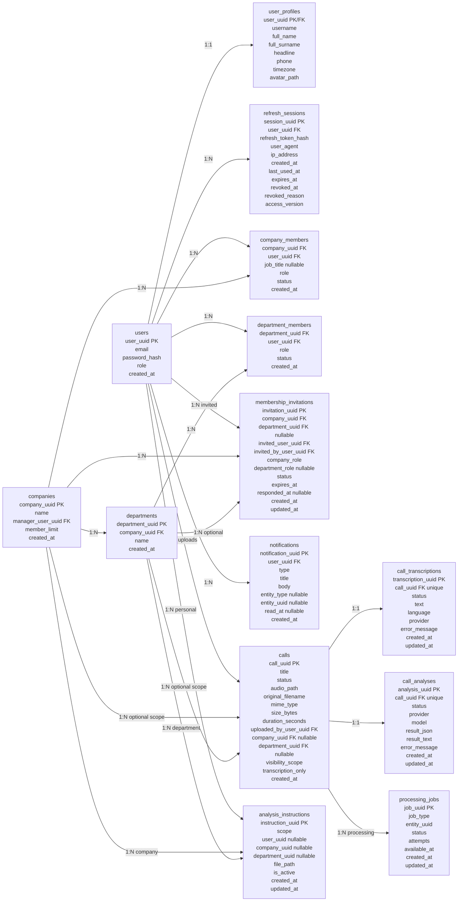
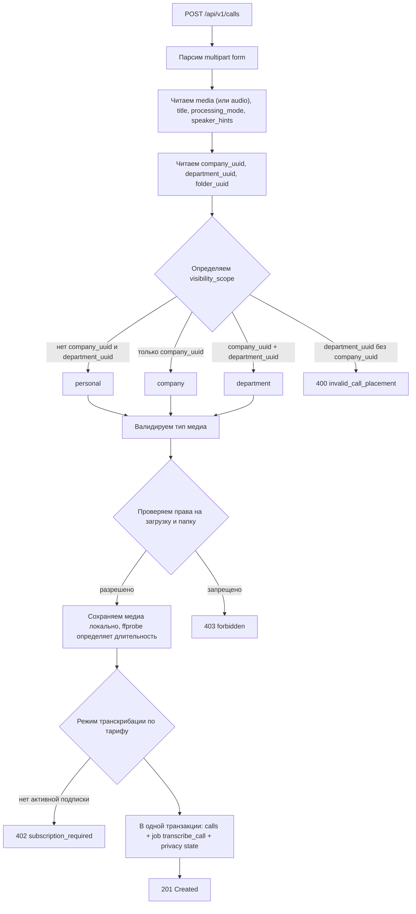
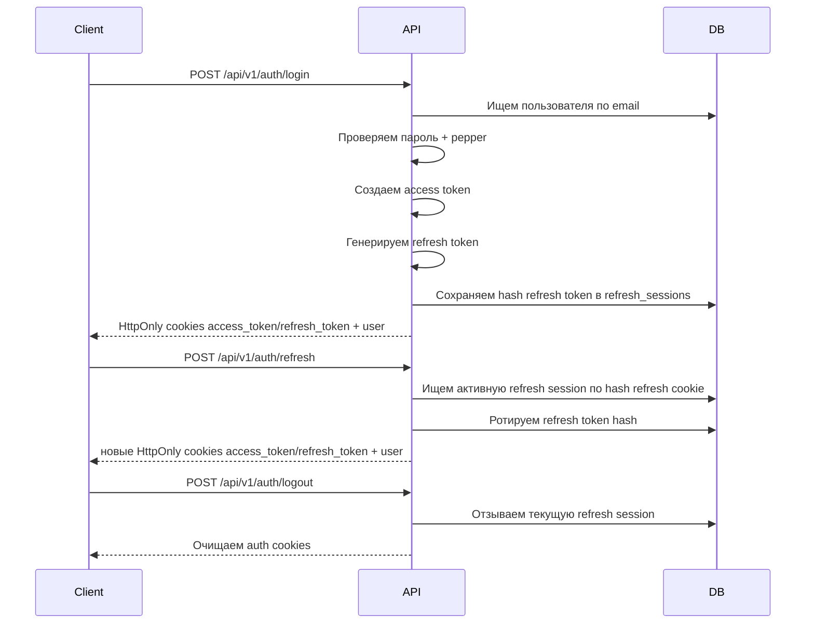

# VerbaTrace

VerbaTrace — платформа анализа аудио- и видеозвонков. Backend-монолит на Go хранит записи, транскрипции, версии анализа и применённых инструкций, управляет доступом компаний и отделов, запускает фоновые задания и предоставляет API для рабочего интерфейса. Frontend находится в соседнем репозитории `C:\projects\VerbaTrace-frontend`.

Backend-код расположен в [`Monolit/`](Monolit). Все команды Go, Task и Docker Compose ниже нужно запускать из этой директории:

```powershell
Set-Location C:\projects\VerbaTrace\Monolit
```

Текущая реализация охватывает авторизацию и подписки, credit billing, загрузку и хранение медиа, транскрибацию (обычную, с диаризацией или с идентификацией спикеров — в зависимости от тарифа), поэтапный AI-анализ, инструкции анализа, Human QA, действия по итогам звонка, отчёты, уведомления, компании, отделы, ролевой доступ, developer ingest API и company-scoped коннектор Bitrix24. Семантический поиск и AI-ассистент по звонкам находятся в разработке.

## Стек

- Go 1.25.7, chi router, pgx v5 (через `database/sql`), zap
- PostgreSQL 16 с расширениями `pgvector` и `pgcrypto` (образ `pgvector/pgvector:0.8.1-pg16`)
- goose migrations, применяются автоматически при старте
- JWT access tokens и refresh sessions в PostgreSQL
- AssemblyAI — транскрибация, диаризация, идентификация спикеров и маскирование персональных данных
- OpenRouter — AI-анализ звонков, embeddings (`openai/text-embedding-3-small`) и ответы ассистента
- `ffmpeg`/`ffprobe` — длительность медиа, ASR-кэш и очищенные медиаверсии
- Локальное хранение медиа, аватаров, инструкций (MD, PDF, DOCX, XLSX) и отчётов на файловой системе
- Server-Sent Events для статуса звонка и уведомлений
- Docker Compose (`deploy/docker-compose.yaml`) для локального стека API + PostgreSQL

## Текущее состояние

Реализовано:

- Регистрация пользователя.
- Логин пользователя.
- Валидация access token.
- Refresh token rotation.
- Серверная инвалидация access token по `access_version`; refresh выдаёт access с актуальной ролью.
- Ограничение на logout-all и удаление других собственных сессий: текущей refresh-сессии должно быть не менее 24 часов.
- Глобальная RBAC-модель `user`, `helper`, `admin`, `superadmin`, capability endpoint и append-only admin audit log.
- Администрирование пользователей, ролей, пользовательских сессий и подписок по UUID.
- Read-only доступ `admin`/`superadmin` к карточке и аудио звонка через `/api/v1/admin/calls/{call_uuid}`.
- Logout и logout-all через отзыв refresh session.
- Ручка текущего пользователя.
- Загрузка звонка с аудио- или видеофайлом.
- Выбор обработки при одиночной и пакетной загрузке: только транскрибация либо транскрибация с последующим анализом.
- Проверка типа медиафайла.
- Определение длительности медиа через `ffprobe`.
- Локальное сохранение исходного медиа и отдельный внутренний ASR-кэш `asr.ogg` (mono 16 kHz, Opus 24 kbit/s) для облачной транскрибации; оригинал сохраняется для воспроизведения и используется только как fallback.
- Список/получение/скачивание аудио/получение транскрипции/обновление title/удаление звонка.
- Очередь `processing_jobs` и worker для фоновой транскрибации и анализа.
- Абстракция transcriber с mock- и AssemblyAI-провайдерами; штатный production-путь транскрибации — AssemblyAI.
- Сохранение транскрипций звонков в `call_transcriptions`.
- Режим транскрибации определяется тарифом: `standard`, `diarized` (разделение на спикеров) или `identified` (идентификация спикеров по подсказкам `speaker_hints` и ролям `diarization_roles`).
- Неизменяемые версии транскрипции, исправление текста и спикеров, получение любой версии для сравнения, восстановление версии и повторный анализ по активной версии.
- Управление инструкциями анализа в форматах MD, PDF, DOCX и XLSX для личного, корпоративного и отделского scope.
- Неизменяемая история версий файлов инструкций, скачивание конкретной версии и снимки инструкций, фактически применённых при анализе звонка.
- Мягкое удаление инструкций с исключением из рабочих списков; окончательная очистка выполняется retention worker только после исчезновения исторических ссылок.
- Абстракция analyzer с mock-провайдером, OpenRouter-провайдером и factory-заглушкой для OpenAI.
- Асинхронный анализ звонка по готовой транскрипции и инструкциям через `processing_jobs`.
- Поэтапный (progressive) анализ `universal-staged-v7`: параллельная инвентаризация вопросов, требования из оценочной карты инструкции (разбор инструкции моделью — только запасной путь), параллельная оценка пунктов пакетами с кэшируемой расшифровкой и итоговое резюме; промежуточные результаты шагов сохраняются в `call_analysis_tasks`, готовые карточки видны до завершения анализа. Результат — универсальный контракт `schema_version=3`.
- Оценочная карта инструкции: каждая версия инструкции один раз раскладывается на атомарные критерии со стабильными ключами, поэтому все звонки по этой версии оцениваются по одному списку, а критерии сопоставимы между звонками и версиями. Вес, отметка «критичный», название и включение правятся вручную новой редакцией; при смене текста ключи переносятся на те же критерии, владелец может исправить сопоставление. Необязательное подтверждение новых критериев перед применением.
- Персонализация анализа (`/analysis-personalization`) — пользовательский контекст до 6000 символов.
- Ручной запуск анализа через HTTP-ручку по готовой транскрипции.
- Сохранение анализа звонка в `call_analyses` с историей попыток (`call_analysis_attempts`).
- Папки звонков с доступом по пользователям и привязанными инструкциями анализа.
- Контакты и избранные звонки.
- Запрос сотрудника на повторный анализ звонка, который решает лидер отдела, заместитель или владелец.
- Retention звонков по тарифу и фоновое удаление просроченных записей.
- SSE-события статуса обработки звонка (`/calls/{uuid}/events`).
- Смена пароля и управление собственными сессиями.
- Семантический поиск по содержимому звонков и AI-ассистент с цитатами (**в разработке**, не готово к релизу; без `EMBEDDING_API_KEY` используется лексический поиск PostgreSQL). Статус: [implementation-status](docs/verification/semantic-search-ai-workspace/implementation-status.md).
- Создание компании.
- Создание отдела.
- Управление участниками компании и отдела, включая независимую должность `company_members.job_title`.
- Разделение учётных данных (`users`) и редактируемого профиля (`user_profiles`).
- Приглашения в компанию и отдел с подтверждением пользователем.
- Глобальный поиск по видимым звонкам, компаниям, отчетам и инструкциям.
- Уведомления для bell с read/unread и SSE API; автоматическое создание подключено для приглашений, действий, Bitrix24-синхронизации и support-доступа.
- Human QA с очередью проверок, черновиком, публикацией неизменяемой ревизии, апелляциями и журналом событий.
- Политики защиты данных для личного, корпоративного и отделского scope: смысловая маскировка, предпросмотр, версии, аудит, контроль доступа к оригиналу и очищенная медиаверсия.
- Экспорт полного отчёта или только выбранной версии транскрипции в PDF, DOCX, Markdown и XLSX; транскрипционный экспорт доступен без анализа.
- Действия по итогам звонка со сроком, ответственным, evidence, сменой статуса, переносом и аудитом изменений.
- Credit ledger с reserve/settle/release/reconciliation, sandbox-балансами, тарифными лимитами и dashboard расхода.
- Developer applications, scoped API keys, URL/multipart ingest, idempotency/dedup, retry/cancel, audit и подписанные webhooks.
- Company-scoped Bitrix24 OAuth с зашифрованными credentials, refresh lease, capability health-check, pause/resume и reconnect state.
- Импорт истории Bitrix24 через `voximplant.statistic.get`: preview периода, пагинация, backfill worker, delayed recording recovery и защита от дублей.
- Сопоставление пользователей Bitrix24 с сотрудниками/отделами VerbaTrace, включая руководителя компании без обязательного отдела.
- Подтверждаемая отправка действий в задачи Bitrix24 с запретом self-approval, optimistic locking, аудитом и ручным разрешением неоднозначного результата/внешних конфликтов.
- Фильтры звонков по времени, длительности, пользователю, отделу, источнику, connection и состоянию обработки.
- Запрашиваемый support-доступ: заявка, одобрение заместителем (без него владельцем), allowlist ресурсов и команд, срок действия, отзыв, аудит и журнал для компании.
- Ролевая модель доступа к загрузке и просмотру звонков.
- Единый JSON-формат ошибок API.
- Логирование запросов.
- Recovery middleware через общий logger.

Пока не реализовано:

- Реальные OpenAI-провайдеры для transcriber и analyzer.
- Реальный платёжный провайдер, invoices и refunds. Внутренний credit billing реализован; пополнить основной кошелёк пока нельзя, тестовое пополнение осталось только для песочницы приложения.
- Email-приглашения.
- Сброс пароля.
- Передача управления компанией другому пользователю.
- Production deploy-конфигурация.
- Финальная приёмка Bitrix24 на настоящем платном телефонном звонке с доступной аудиозаписью. Репозиторная реализация и read-only проверка портала не заменяют этот внешний тест.

## Основные сущности

Диаграмма показывает только ядро схемы. Версии транскрипций, инструкций и анализа, биллинг, интеграции, privacy, Human QA, действия и поиск хранятся в отдельных таблицах — см. [Monolit/migrations](Monolit/migrations).



## Роли и статусы

Роли в компании:

- `company_manager` - владелец компании. Может всё, включая действия, недоступные заместителю.
- `company_deputy` - заместитель владельца, закреплён за одной компанией. Имеет права владельца, кроме удаления компании, подписки и лимитов, назначения заместителей, передачи владения и влияния на другого заместителя. В компании не больше одного активного заместителя.
- `employee` - обычный участник компании.

Роли в отделе:

- `department_leader` - лидер/руководитель отдела.
- `employee` - обычный участник отдела.

Статусы участников:

- `active`
- `left`

В проекте для участников используется изменение статуса, а не физическое удаление строки из БД. Это позволяет сохранить историю членства.

Правила членства:

- Человек может одновременно работать в нескольких компаниях. Прежнее правило «сотрудник активен ровно в одной компании» отменено вместе с индексом `uq_company_members_single_active_employee` (миграция `202609170006`).
- Внутри компании человек активен ровно в одном отделе (`uq_department_members_one_active_company`). Это правило осталось: от него зависят видимость звонков и лимиты отделов.
- В компании не больше одного активного заместителя (`uq_company_members_active_deputy`).
- Замом становятся двумя путями: повышением участника или приглашением сразу на роль `company_deputy`. Требования «сначала стать сотрудником» больше нет.
- Интерфейс работает в разрезе выбранной компании (`user_preferences.active_company_uuid`); переключатель компании живёт в шапке приложения. Выбор задаёт разрез для звонков, действий и AI-отчётов: компания — данные этой компании, «Личный кабинет» — только личные. Явный фильтр в ссылке (`?company_uuid=…`, `?scope=…`) сильнее переключателя и сохраняется при открытии, но следующее переключение компании в шапке снова задаёт разрез.
- Исключение сотрудника владельцем или заместителем закрывает членство в компании и во всех её отделах, снимает доступы к папкам, очищает выбранную активную компанию, отменяет приглашения от этой компании и снимает сопоставление в Bitrix24. Открытые действия ушедшего переназначаются автоматически по градации лидер отдела → заместитель → владелец.

Статусы приглашений:

- `pending`
- `accepted`
- `declined`
- `canceled`
- `expired`

У приглашения есть отдельный статус одобрения `approval_status`: `not_required`, `pending`, `approved`, `rejected`. Пока одобрение не получено, приглашение не видно приглашённому.

## Видимость звонков

У звонка есть поле `visibility_scope`:

- `personal`
- `company`
- `department`

Кто видит звонок (`internal/repository/call/access.go` — единственное место, где это решается):

- автор звонка;
- владелец и заместитель компании звонка;
- лидер отдела звонка.

Обычный сотрудник видит только свои звонки — независимо от `visibility_scope`. Тот же предикат обязаны переиспользовать все списки: отчёты, поиск, ассистент и содержимое папок. Звонок в корзине (`deleted_at IS NOT NULL`) не виден никому, кроме списка корзины.

Удалять, восстанавливать и видеть корзину может тот, кто отвечает за звонок: автор личного звонка, лидер отдела, заместитель и владелец компании. Сотрудник не может удалить звонок компании.

Статусы обработки звонка:

- `new` - звонок сохранён и ожидает обработки.
- `processing` - обработчик забрал звонок в работу.
- `awaiting_credits` - лимит кредитов исчерпан; звонок принят и ждёт в очереди, обработка начнётся сама, когда лимит обновится. Это не ошибка.
- `cancelled` - обработку остановили намеренно. Запись на месте, звонок можно запустить заново, скачать или удалить в корзину.
- `transcribed` - аудио переведено в текст.
- `analyzed` - по транскрипту построен анализ.
- `failed` - обработка завершилась ошибкой.

`new` используется как состояние очереди. Worker забирает задания `transcribe_call`, переводит звонок в `processing`, сохраняет транскрипцию и переводит звонок в `transcribed`. В обычном режиме после этого ставится `analyze_call`; при `transcription_only=true` обработка завершается без автоматического анализа. Задание анализа загружает готовую транскрипцию, выбирает подходящие инструкции, сохраняет результат в `call_analyses` и при успехе переводит звонок в `analyzed`. HTTP-ручка анализа позволяет позже запустить анализ готовой транскрипции вручную.

Статусы транскрипции:

- `processing`
- `transcribed`
- `failed`

Статусы анализа:

- `pending`
- `processing`
- `done`
- `failed`
- `stale` — результат устарел после изменения транскрипции или политики защиты данных

Правила целостности в БД:

- `personal`: `company_uuid` и `department_uuid` должны быть `NULL`.
- `company`: `company_uuid` должен быть заполнен, `department_uuid` должен быть `NULL`.
- `department`: должны быть заполнены и `company_uuid`, и `department_uuid`.

Правила просмотра:

- Пользователь видит звонки, которые сам загрузил.
- `company_manager` видит все звонки своей компании.
- `department_leader` видит звонки своего отдела.
- `employee` видит только свои звонки.

Правила загрузки:

- Любой авторизованный пользователь может загрузить личный звонок.
- Только `company_manager` может загрузить звонок на уровне компании.
- `company_manager`, `department_leader` и `employee` целевого отдела могут загрузить звонок на уровне отдела.
- Для любой загрузки нужна активная подписка (персональная для личного звонка, бизнес-подписка компании для company/department); без неё API возвращает `402 subscription_required`.
- Звонки из интеграций (developer API, Bitrix24) проходят проверку прав на уровне ключа или подключения, а не пользователя.



## Авторизация



## Управление участниками

Реализованные операции:

- Создать приглашение в компанию.
- Создать приглашение в отдел.
- Получить входящие приглашения текущего пользователя.
- Принять или отклонить приглашение.
- Отменить pending-приглашение.
- Получить приглашения компании за последние три месяца, одобрить или отклонить приглашение лидера.
- Исключить участника компании.
- Назначить или снять заместителя владельца.
- Предложить передачу владения компанией, принять, отклонить или отозвать предложение.
- Добавить участника отдела или перевести его между отделами.
- Отправить запрос на перевод сотрудника из другого отдела и решить его.
- Получить структурированный обзор участников компании.
- Получить агрегированный analytics overview по видимым звонкам.
- Получить monitoring summary очереди обработки для admin/superadmin или управляющего своей компанией.
- Получить участников отдела.
- Изменить роль участника отдела.
- Изменить статус участника отдела.

Прямого добавления участника в компанию нет: единственный путь в компанию это приглашение.

Структурированный обзор компании возвращает данные в удобном для frontend виде:

```json
{
  "company_uuid": "...",
  "manager": {
    "company_uuid": "...",
    "user_uuid": "...",
    "role": "company_manager",
    "status": "active",
    "created_at": "..."
  },
  "company_employees": [],
  "departments": [
    {
      "department": {
        "id": "...",
        "company_uuid": "...",
        "name": "Sales",
        "created_at": "..."
      },
      "members": []
    }
  ]
}
```

### Приглашения

Pending-приглашение не создаёт `active` membership и не даёт доступ к компании или отделу. Пользователь становится активным участником только после `accept`.

Права:

- Заместитель может приглашать пользователя в компанию только как `employee`. Владелец может приглашать и как `company_deputy`, если место заместителя свободно, иначе `409 company_deputy_already_assigned`.
- Владелец и заместитель могут приглашать пользователя в любой отдел как `employee` или `department_leader`.
- `department_leader` может приглашать только в свой отдел и только как `employee`.
- `department_leader` не может пригласить руководителя другого отдела.
- Приглашение в отдел человеку, который уже состоит в другом отделе этой компании, возвращает `409 department_transfer_required` с `user_uuid` в деталях — независимо от того, кто приглашает. Внутри компании это перевод, а не второе членство: прямой перевод делают владелец и заместитель, лидер отправляет запрос.

Подтверждения:

- Работа в другой компании больше не конфликт: приглашение создаётся и принимается без подтверждений, а прежние членства не закрываются.
- Если владелец или заместитель исключил человека, приглашение от лидера отдела создаётся со статусом одобрения `pending` и уходит заместителю. Запись об исключении живёт полгода.
- Пользователь может полностью запретить приглашения флагом `invitations_muted` в настройках. Тогда приглашение возвращает `409 invitations_muted`.

Прочее:

- Срок жизни приглашения неделя, просроченные помечает фоновый воркер.
- Приглашения автоматически отменяются при удалении компании или отдела и при уходе приглашённого.
- Принятие приглашения в отдел переводит прежнее членство в отделе в `left`. Приглашение уже активному участнику этого отдела отклоняется.
- Для company-invite лимит участников проверяется на `accept`, pending invitation не занимает место в лимите.

## Bitrix24-коннектор

Корпоративный коннектор создаётся для компании и управляется владельцем или
заместителем; они же настраивают сопоставление пользователей портала.
OAuth-токены сохраняются зашифрованно; браузер получает только состояние
подключения и capabilities. Основной read-контур использует официальный
`voximplant.statistic.get`, users — `user.get`, задачи — методы `tasks.task.*`.

Звонок портала принимается, только если его пользователь сопоставлен с
аккаунтом VerbaTrace, а этот аккаунт состоит в компании. Иначе приём отклоняется
с `422 external_user_not_mapped`: у звонка должен быть настоящий автор, а не
тот, кто подключил портал. Загрузившим становится сопоставленный пользователь,
отдел берётся из сопоставления.

Личное подключение доступно владельцу личной подписки Pro: ключ личный,
сопоставление не нужно, все звонки портала попадают в личные звонки владельца
ключа. Это режим для проверки перед покупкой бизнес-подписки.

Поддержанный поток:

1. Создать company-owned developer application и connection с provider `bitrix24`.
2. Пройти server-side OAuth и выполнить capability check.
3. Сопоставить пользователей портала с участниками и отделами VerbaTrace.
4. Проверить период и запустить идемпотентный backfill звонков.
5. После появления записи импортировать звонок в общий ingest/processing pipeline.
6. Создать внутреннее действие, отправить запрос на синхронизацию и получить
   отдельное одобрение manager/department leader перед `tasks.task.add`.
7. Сверять внешнюю задачу и вручную разрешать изменения, удаление или
   неоднозначный результат вместо слепого повтора.

Состояние `degraded` отключает только недоступные возможности. Если чтение
статистики подтверждено, reconciliation и backfill продолжают работать даже при
отсутствии права создания задач. `connector_verified` не выставляется одним
health-check: для него нужна сохранённая приёмка реального звонка, записи,
импорта и task-flow. Аренда номера и телефонный трафик в Bitrix24 могут быть
платными и не входят в локальные автоматические тесты.

Операционные детали и порядок приёмки описаны в
[runbook](docs/runbooks/bitrix24-connector.md).

## API

Базовый путь:

```text
/api/v1
```

Health:

| Method | Path | Auth | Описание |
| --- | --- | --- | --- |
| GET | `/health` | Нет | Проверка состояния API |
| GET | `/health/live` | Нет | Liveness: процесс API отвечает |
| GET | `/health/ready` | Нет | Readiness: PostgreSQL, uploads, `ffmpeg` и `ffprobe` доступны |
| GET | `/health/startup` | Нет | Startup: стартовая инициализация завершена |

Auth:

| Method | Path | Auth | Описание |
| --- | --- | --- | --- |
| POST | `/api/v1/auth/register` | Нет | Регистрация пользователя |
| POST | `/api/v1/auth/login` | Нет | Логин, создание refresh session и установка auth cookies |
| POST | `/api/v1/auth/refresh` | Нет | Ротация refresh token из cookie |
| GET | `/api/v1/auth/me` | Да | Получить текущего пользователя |
| PATCH | `/api/v1/auth/me/password` | Да | Сменить пароль текущего пользователя |
| GET | `/api/v1/auth/me/sessions` | Да | Получить активные refresh session текущего пользователя |
| DELETE | `/api/v1/auth/me/sessions/{session_uuid}` | Да | Отозвать одну свою refresh session |
| PATCH | `/api/v1/auth/me/profile` | Да | Частично обновить профиль пользователя |
| POST | `/api/v1/auth/me/avatar` | Да | Загрузить avatar через multipart field `avatar` |
| GET | `/api/v1/auth/me/avatar` | Да | Получить файл avatar |
| DELETE | `/api/v1/auth/me/avatar` | Да | Сбросить avatar к буквенной заглушке |
| GET | `/api/v1/auth/me/preferences` | Да | Получить UI preferences пользователя |
| PATCH | `/api/v1/auth/me/preferences` | Да | Частично обновить UI preferences пользователя |
| PATCH | `/api/v1/auth/me/username` | Да | Сменить username |
| GET | `/api/v1/users/lookup` | Да | Найти пользователя (например, для приглашения) |
| POST | `/api/v1/auth/logout` | Да | Отозвать текущую session |
| POST | `/api/v1/auth/logout-all` | Да | Отозвать все session пользователя |

`PATCH /api/v1/auth/me/password` принимает:

```json
{
  "current_password": "old password",
  "new_password": "new strong password"
}
```

Backend проверяет текущий пароль, применяет действующее правило сложности пароля (минимум 8 символов), обновляет password hash и отзывает все refresh session пользователя, кроме текущей. Ответ:

```json
{
  "updated_at": "2026-07-02T10:00:00Z"
}
```

`GET /api/v1/auth/me/sessions` возвращает только активные, не истекшие refresh session текущего пользователя и не раскрывает raw refresh token или token hash:

```json
{
  "sessions": [
    {
      "id": "session_uuid",
      "current": true,
      "user_agent": "Chrome on Windows",
      "ip": "127.0.0.1/32",
      "created_at": "2026-07-02T10:00:00Z",
      "last_seen_at": "2026-07-02T12:00:00Z"
    }
  ]
}
```

Ответ также содержит `can_manage_other_sessions`, `available_at` и `retry_after_seconds`: управлять другими сессиями можно только из сессии не моложе `AUTH_SESSION_TRUST_AGE` (по умолчанию 24 часа).

`last_seen_at` сейчас отражает последнее refresh/rotation событие (`last_used_at`); если refresh еще не было, используется `created_at`. Middleware не обновляет это поле на каждый authenticated request, чтобы не добавлять запись в БД на каждый запрос.

`DELETE /api/v1/auth/me/sessions/{session_uuid}` отзывает только session текущего пользователя. Если удаляется текущая session, backend дополнительно очищает auth cookies. Отзыв чужой session и `POST /api/v1/auth/logout-all` из слишком новой session возвращают `403 session_trust_age_required` с заголовком `Retry-After`.

`PATCH /api/v1/auth/me/profile` принимает частичный JSON с полями `full_name`, `full_surname`, `headline`, `phone`, `timezone` и возвращает обновленный `UserResponse`. `headline` — общее профессиональное описание пользователя и не зависит от членства в компаниях. `timezone` проверяется через IANA timezone database, например `Europe/Moscow`.

`POST /api/v1/auth/me/avatar` принимает multipart upload в поле `avatar`, сохраняет image-файл в локальном storage и возвращает:

```json
{
  "avatar_url": "/api/v1/auth/me/avatar",
  "updated_at": "2026-07-02T10:00:00Z"
}
```

`PATCH /api/v1/auth/me/preferences` принимает частичный JSON с `active_company_uuid`, `theme` (`system`, `light`, `dark`) и `date_range.from` / `date_range.to` в формате `YYYY-MM-DD`. `active_company_uuid` разрешен только для компании, где текущий пользователь является активным участником.

Calls:

| Method | Path | Auth | Описание |
| --- | --- | --- | --- |
| POST | `/api/v1/calls` | Да | Загрузить аудио- или видеозапись звонка |
| GET | `/api/v1/calls` | Да | Получить список видимых звонков |
| GET | `/api/v1/calls/filters` | Да | Получить справочник фильтров для списка звонков |
| GET | `/api/v1/calls/{uuid}` | Да | Получить видимый звонок по UUID |
| GET | `/api/v1/calls/{uuid}/audio` | Да | Получить медиафайл звонка (совместимый alias `/media`) |
| GET | `/api/v1/calls/{uuid}/media` | Да | Получить аудио или видео звонка с учётом политики защиты данных |
| GET | `/api/v1/calls/{uuid}/events` | Да | SSE-поток изменений статуса обработки звонка |
| GET | `/api/v1/calls/{uuid}/transcription` | Да | Получить сохраненную транскрипцию звонка |
| PATCH | `/api/v1/calls/{uuid}/transcription` | Да | Сохранить исправление транскрипции новой версией |
| GET | `/api/v1/calls/{uuid}/transcription/revisions` | Да | Получить историю версий транскрипции |
| GET | `/api/v1/calls/{uuid}/transcription/revisions/{revision}` | Да | Получить конкретную версию транскрипции |
| POST | `/api/v1/calls/{uuid}/transcription/revisions/{revision}/restore` | Да | Восстановить версию как новую активную |
| GET/PUT | `/api/v1/calls/{uuid}/transcription/speakers` | Да | Получить или заменить назначения спикеров |
| POST | `/api/v1/calls/{uuid}/analysis` | Да | Поставить `analyze_call` job по активной версии транскрипции |
| GET | `/api/v1/calls/{uuid}/analysis` | Да | Получить сохраненный анализ звонка |
| POST | `/api/v1/calls/{uuid}/analysis-rerun-requests` | Да | Запросить повторный анализ звонка компании |
| GET | `/api/v1/companies/{uuid}/analysis-rerun-requests` | Да | Очередь запросов на повторный анализ |
| POST | `/api/v1/analysis-rerun-requests/{request_uuid}/{approve\|reject}` | Да | Решение по запросу; одобрение сразу запускает анализ |
| GET | `/api/v1/analyses/{analysis_uuid}/instructions` | Да | Получить снимки инструкций, применённых в анализе |
| GET | `/api/v1/analyses/{analysis_uuid}/instructions/{version_uuid}` | Да | Получить одну применённую версию инструкции |
| POST | `/api/v1/calls/{uuid}/reports` | Да | Создать отчет по одному видимому звонку |
| GET | `/api/v1/calls/{uuid}/reports` | Да | Получить отчеты одного видимого звонка |
| GET | `/api/v1/reports` | Да | Получить глобальный список отчетов по видимым звонкам |
| POST | `/api/v1/reports` | Да | Создать отчет из глобальной страницы |
| GET | `/api/v1/reports/{report_uuid}/download` | Да | Скачать готовый отчет |
| DELETE | `/api/v1/reports/{report_uuid}` | Да | Удалить отчет |
| PATCH | `/api/v1/calls/{uuid}` | Да | Обновить title звонка |
| DELETE | `/api/v1/calls/{uuid}` | Да | Переместить звонок в корзину на 30 дней |
| GET | `/api/v1/calls-bin` | Да | Получить звонки в корзине (`limit`, `offset`) |
| POST | `/api/v1/calls/{uuid}/restore` | Да | Вернуть звонок из корзины |
| POST | `/api/v1/calls/{uuid}/cancel-processing` | Да | Остановить обработку звонка и оставить запись |
| POST | `/api/v1/calls/{uuid}/restart-processing` | Да | Запустить обработку отменённого звонка заново |

Удаление звонка мягкое: строка и файлы остаются 30 дней (`deleted_at`, `purge_after`),
звонок исчезает из всех списков, поиска, ассистента и очереди обработки, но его
можно вернуть. По истечении срока call-worker retention удаляет запись вместе с
аудио, отчетами и медиавариантами. Удалять и восстанавливать может тот, кто
отвечает за звонок: автор личного звонка, лидер его отдела, заместитель и
владелец компании. Им же виден список корзины; обычный сотрудник корзину не
видит и чужой звонок удалить не может.

Звонок в обработке (`new`, `processing`, `awaiting_credits`) удалить нельзя:
`DELETE` возвращает `409 call_processing_in_progress`. Сначала его останавливают
через `POST /api/v1/calls/{uuid}/cancel-processing` — задачи снимаются с очереди,
незавершённые транскрипция и анализ помечаются отменёнными, резерв кредитов
возвращается, звонок переходит в статус `cancelled`. Запись при этом остаётся, и
TTL у неё обычный.

Из состояния `cancelled` звонок можно запустить заново:
`POST /api/v1/calls/{uuid}/restart-processing` с телом
`{"processing_mode":"analyze"|"transcribe"}`. Обработка ставится в очередь снова
и подчиняется тому же лимиту ожидания, что и загрузка. Если транскрипт уже готов,
`transcribe` просто переключает звонок в режим «только транскрибация»: ничего не
отправляется провайдеру и повторной оплаты нет. Такое переключение доступно из
`cancelled` и `transcribed` — у звонка со статусом `failed` его нет, потому что
сломаться могла сама транскрипция и объявлять звонок завершённым нельзя. Права на
отмену и перезапуск — те же, что на удаление.

`POST /api/v1/calls` принимает multipart-поле `processing_mode`: `transcribe`
завершает обработку после транскрипции, `analyze` запускает последующий анализ.
Отсутствие поля сохраняет прежнее поведение `analyze`. Неизвестное значение
возвращает `400 invalid_request_body`. Режим только транскрибации доступен на
всех тарифах; обычные правила доступа, хранения и списания за транскрибацию
сохраняются. Остальные поля загрузки описаны в разделе «Загрузка звонка» ниже.

Транскрипцию правит каждый, кто видит звонок: право на чтение и есть право на
исправление. Пока по звонку идёт проверка качества (`call_quality_reviews` в
статусе `unassigned`, `assigned`, `in_review` или `appealed`), правка текста,
восстановление версии и замена спикеров возвращают `409
transcription_locked_by_review` — проверяющий должен видеть тот же текст, что и
проверяемый. Изменение слов помечает готовый анализ и поисковый документ как
`stale`; переименование спикера текст не меняет и ничего не обесценивает.

Ответ `GET /api/v1/calls/{uuid}/transcription` содержит `words` — упорядоченный
массив слов с `start_seconds`, `end_seconds`, необязательными `confidence` и
`speaker`. Для старых транскрипций поле возвращается как пустой массив. В сохраненном
анализе поле `evidence` содержит только детерминированные связи цитаты с диапазоном
слов и аудио; статусы `ambiguous` и `not_found` не получают таймкод.

`GET /api/v1/calls` без query-параметров сохраняет старую форму ответа и возвращает массив `CallResponse`.

`CallResponse` содержит совместимый URL аудиопотока и нейтральный media-контракт для аудио/видео:

```json
{
  "id": "call_uuid",
  "audio_url": "/api/v1/calls/{uuid}/audio",
  "media_url": "/api/v1/calls/{uuid}/media",
  "media_kind": "audio | video",
  "transcription_only": true
}
```

Для транскрипции доступны история неизменяемых версий, получение конкретной
версии (сравнение выполняет клиент), исправление текста и назначений спикеров и
восстановление старой версии как новой активной. `POST /calls/{uuid}/analysis`
не принимает body и анализирует текущую активную версию; история транскрипции
при этом не перезаписывается.

Первый анализ запускает любой, кто видит звонок. Повторный анализ звонка
компании — решение о записи, поэтому его запускает лидер её отдела, заместитель
или владелец; сотруднику возвращается `403 analysis_rerun_forbidden`, и он
отправляет запрос через `/calls/{uuid}/analysis-rerun-requests`. Запрос видят
лидеры отдела звонка, а если лидера нет — заместитель или владелец; одобрение
сразу ставит задание анализа. Личный звонок его автор перезапускает сам,
ограничения на число перезапусков нет.

`GET /api/v1/calls/{uuid}/audio` и `/media` обслуживаются одним handler:

- требуют авторизацию;
- доступны только если текущему пользователю виден сам звонок;
- принимают `variant` (по умолчанию `recommended` — очищенная медиаверсия, если у пользователя нет права на оригинал) и `access_session` для ограниченного доступа к оригиналу;
- возвращают бинарный stream с `Content-Disposition: inline` и `Cache-Control: private, no-store`;
- используют сохраненный `mime_type` как `Content-Type`, если он известен;
- поддерживают `Range` и `Accept-Ranges: bytes` для перемотки HTML `<audio>`/`<video>` плеера;
- возвращают `404 call_not_found`, если звонка нет или он не видим;
- возвращают `403 original_media_forbidden` без права на оригинал и `422 privacy_policy_invalid` при некорректной политике;
- возвращают `410 audio_file_not_found`, если запись звонка существует, но файл физически недоступен.

Если передан хотя бы один фильтр или параметр пагинации, ответ возвращается в envelope:

```json
{
  "items": [{ "...": "CallResponse" }],
  "total": 42,
  "limit": 20,
  "offset": 0
}
```

Поддерживаемые query-параметры:

| Параметр | Значение |
| --- | --- |
| `q` | Поиск по `title` и `original_filename` |
| `status` | `new`, `processing`, `awaiting_credits`, `cancelled`, `transcribed`, `analyzed`, `failed`; можно несколько значений |
| `scope` | `personal`, `company`, `department`; можно несколько значений |
| `company_uuid` | UUID компании |
| `department_uuid` | UUID отдела; можно несколько значений |
| `uploaded_by_user_uuid` | UUID пользователя, загрузившего звонок |
| `participant_user_uuid` | UUID участника звонка |
| `folder_uuid` | UUID активной видимой папки; можно несколько значений |
| `source_provider` | `manual`, `generic_api`, `bitrix24` |
| `connection_uuid` | UUID интеграционного подключения |
| `from` / `to` | ISO date/datetime, границы `created_at`; дата `YYYY-MM-DD` в `to` считается до конца дня |
| `occurred_from` / `occurred_to` | Границы фактического времени звонка `occurred_at` |
| `imported_from` / `imported_to` | Границы времени импорта из интеграции |
| `duration_min_seconds` / `duration_max_seconds` | Диапазон длительности |
| `has_analysis`, `has_actions`, `has_processing_error`, `favorite_only` | `true`/`false` |
| `include_upload_fallback` | Учитывать время загрузки, если `occurred_at` неизвестен |
| `sort` | `occurred_at` (по умолчанию), `created_at`, `duration` |
| `order` | `desc` (по умолчанию) или `asc` |
| `cursor` | Курсор следующей страницы (`next_cursor` из предыдущего ответа) |
| `limit` | 1..100; по умолчанию 20 для filtered/envelope-ответа |
| `offset` | 0 или больше; по умолчанию 0 |

Все фильтры применяются только поверх видимых текущему пользователю звонков. Некорректный фильтр возвращает `400 invalid_call_filter`, невидимая папка — `404 call_folder_not_found`. Envelope-ответ может содержать `next_cursor`.

Дополнительно `GET /api/v1/calls` принимает `folder_uuid`. Фильтр возвращает только видимые текущему пользователю звонки, назначенные в активную папку. Доступ к самой папке проверяется отдельно; чужая или удаленная папка не должна раскрывать скрытые звонки.

`GET /api/v1/calls/filters` принимает optional `company_uuid` и `department_uuid` и возвращает:

```json
{
  "statuses": ["new", "processing", "awaiting_credits", "cancelled", "transcribed", "analyzed", "failed"],
  "scopes": ["personal", "company", "department"],
  "managers": [
    {
      "id": "user_uuid",
      "full_name": "Ivan",
      "full_surname": "Petrov",
      "username": "petrov"
    }
  ],
  "connections": [
    {
      "id": "connection_uuid",
      "name": "Bitrix24",
      "provider": "bitrix24"
    }
  ]
}
```

Поле `managers` в справочнике содержит компактный список пользователей, которые загрузили видимые текущему пользователю звонки в выбранном scope компании/отдела. Название поля сохранено для frontend-контракта фильтров.

Call folders:

Папки звонков группируют звонки по теме или рабочей области для последующей фильтрации списка и analytics. Папка не является `analysis_instruction`: инструкция отвечает на вопрос "как анализировать", а папка отвечает на вопрос "к какой группе относится звонок".

| Method | Path | Auth | Описание |
| --- | --- | --- | --- |
| GET | `/api/v1/call-folders` | Да | Получить видимые папки с `calls_count` |
| POST | `/api/v1/call-folders` | Да | Создать папку |
| GET | `/api/v1/call-folders/{folder_uuid}` | Да | Получить одну видимую папку |
| PATCH | `/api/v1/call-folders/{folder_uuid}` | Да | Обновить `name`, `description`, `color` |
| DELETE | `/api/v1/call-folders/{folder_uuid}` | Да | Soft-delete папки через `deleted_at` |
| GET | `/api/v1/call-folders/{folder_uuid}/calls` | Да | Получить звонки папки в форме `{ items, total, limit, offset }` |
| POST | `/api/v1/call-folders/{folder_uuid}/calls` | Да | Идемпотентно назначить звонок в папку |
| DELETE | `/api/v1/call-folders/{folder_uuid}/calls/{call_uuid}` | Да | Убрать звонок из папки |
| PUT | `/api/v1/call-folders/{folder_uuid}/instructions` | Да | Заменить набор инструкций анализа, привязанных к папке |

`GET /api/v1/call-folders` принимает `scope=personal|company|department`, `company_uuid`, `department_uuid`, `q`, `limit`, `offset`. `limit` по умолчанию `20`, максимум `100`. Без `scope` возвращаются все видимые папки. Для `company` нужен `company_uuid`; для `department` нужны `company_uuid` и `department_uuid`; для `personal` `company_uuid` и `department_uuid` не передаются.

Пример `CallFolderResponse`:

```json
{
  "id": "folder_uuid",
  "scope": "personal",
  "user_uuid": "user_uuid",
  "company_uuid": null,
  "department_uuid": null,
  "name": "Возражения по цене",
  "description": "Звонки, где клиент сомневался из-за цены",
  "color": "#3b82f6",
  "calls_count": 12,
  "instructions": [],
  "created_by_user_uuid": "user_uuid",
  "created_at": "2026-07-05T10:00:00Z",
  "updated_at": "2026-07-05T10:00:00Z"
}
```

Права:

- `personal`: владелец создает, читает, обновляет, удаляет и назначает только свои personal-звонки.
- `company`: управляет активный `company_manager` или `company_deputy`; читают они же и любой сотрудник, чей звонок лежит в этой папке.
- `department`: управляет активный `company_manager`, `company_deputy` или `department_leader` этого отдела; читают они же и сотрудник, чей звонок лежит в папке.

Отдельных выдач доступа к папке нет: папка — это ярлык к звонкам, а не способ расширить их видимость. `GET /api/v1/call-folders/{folder_uuid}/calls` возвращает только те звонки папки, которые видны вызывающему, `calls_count` не считает звонки в корзине.

Назначение звонка проверяет совпадение scope: personal-папка принимает только personal-звонок владельца, company-папка только звонки этой компании, department-папка только звонки этой компании и отдела. Несовпадение возвращает `400 call_folder_scope_mismatch`. Удаленная папка не возвращается в списках и не принимает новые назначения. `GET /api/v1/calls/filters` пока не возвращает список папок.

Privacy and protected media:

| Method | Path | Описание |
| --- | --- | --- |
| GET; PUT draft; POST preview/publish | `/api/v1/privacy-policies/personal[...]` | Личная политика: чтение, черновик, предпросмотр и публикация |
| GET; PUT draft; POST preview/publish; GET versions[/{version}] | `/api/v1/companies/{company_uuid}/privacy-policy[...]` | Политика компании и её опубликованные версии |
| GET; PUT draft; POST preview/publish; GET versions[/{version}] | `/api/v1/companies/{company_uuid}/departments/{department_uuid}/privacy-policy[...]` | Политика отдела и её опубликованные версии |
| GET | `/api/v1/calls/{uuid}/privacy` | Состояние защиты конкретного звонка |
| POST/GET | `/api/v1/calls/{uuid}/media-variants/redacted` | Создать или получить очищенную медиаверсию |
| POST | `/api/v1/calls/{uuid}/media-access-sessions` | Получить ограниченную сессию доступа к оригиналу |
| POST | `/api/v1/calls/{uuid}/privacy-corrections[/preview]` | Предпросмотреть или применить исправление маскировки |
| GET | `/api/v1/calls/{uuid}/privacy-audit` | Получить журнал защиты звонка |

Политика выбирается по scope звонка и сохраняется снимком. Анализ использует
защищённое представление транскрипции. Для видео очищается только звуковая
дорожка; видеоряд не размывается. Доступ к оригиналу проверяется отдельно и
аудируется.

Reports:

`POST /api/v1/calls/{uuid}/reports` и `POST /api/v1/reports` с `scope=call` используют один и тот же генератор отчета по звонку. Поддерживаемые форматы: `pdf`, `docx`, `md`, `xlsx`. Для `scope=company`, `department`, `manager`, `period` API возвращает `501 not_implemented`, пока в backend нет реального агрегированного генератора.

`POST /api/v1/calls/{uuid}/reports` принимает `content=full|transcription`,
`transcription_revision` и `privacy_variant` (допустимо только `redacted`).
`POST /api/v1/reports` со `scope=call` эти поля не принимает и всегда строит
`full`-отчёт. `full` требует готового анализа и сохраняет тарифные
ограничения аналитического экспорта. `transcription` формирует отчёт только по
выбранному неизменяемому снимку транскрипции, не требует анализа и доступен на
всех тарифах. В таком отчёте `analysis_uuid=null`; имена спикеров и таймкоды
выводятся при наличии этих данных в выбранной версии. Разные форматы, варианты
содержимого и версии дедуплицируются независимо.

Отчёт по звонку удаляет тот, кто отвечает за звонок: лидер его отдела, заместитель, владелец компании, а по личному звонку — его автор.


Analytics and monitoring:

| Method | Path | Auth | Описание |
| --- | --- | --- | --- |
| GET | `/api/v1/analytics/overview` | Да | KPI summary по видимым текущему пользователю звонкам |
| GET | `/api/v1/analytics/capabilities` | Да | Роль зрителя в выбранной области, доступные отделы, флаги тарифа, срок хранения истории |
| GET | `/api/v1/analytics/summary` | Да | Сводка периода: звонки с анализом, средний балл с дельтой, критичные пропуски, тренд, отметки смены инструкций, «Стоит послушать» |
| GET | `/api/v1/analytics/criteria` | Да | Критерии: средний балл, дельта, распределение статусов, мини-тренд; `sort`, `order` |
| GET | `/api/v1/analytics/criteria/{criterion_key}/calls` | Да | Раскрытие критерия: звонки с моментом в записи; `status`, `sort`, `limit` (≤100), `offset` |
| GET | `/api/v1/analytics/employees` | Да | Сотрудники: средний балл, дельта, звонки, критичные пропуски; бывшие — с пометкой |
| GET | `/api/v1/analytics/employees/{user_uuid}` | Да | Профиль сотрудника; `me` — свой профиль |
| GET | `/api/v1/analytics/employees/{user_uuid}/progress` | Да | Работа над ошибками сотрудника: открытые ошибки и закрытые за период |
| GET | `/api/v1/calls/{uuid}/progress` | Да | Работа над ошибками звонка: каждый оценённый критерий против прошлого звонка сотрудника |
| GET | `/api/v1/analytics/employees/{user_uuid}/growth-areas` | Да | Зоны роста сотрудника с лентой наблюдений; `status=open|resolved|dismissed`, по умолчанию все, кроме скрытых; доступ как к профилю |
| POST | `/api/v1/growth-areas/{area_uuid}/dismiss` | Да | Скрыть зону `{reason}` (причина обязательна, `422 invalid_growth_area_reason`); сотрудник, лидер его отдела, заместитель, владелец; запись в `growth_area_events` |
| POST | `/api/v1/growth-areas/{area_uuid}/reopen` | Да | Вернуть скрытую зону (`409 growth_area_not_dismissed`, если не скрыта) |
| GET | `/api/v1/analytics/departments` | Да | Отделы компании и строка всей компании |
| GET | `/api/v1/analytics/matrix` | Да | Матрица «сотрудник × критерий» одной инструкции (до 30 критериев) |
| GET/PATCH | `/api/v1/companies/{uuid}/analytics-settings` | Да | Настройки аналитики компании (`critical_alert_threshold`, `growth_areas_enabled`, `lock_version`); владелец и заместитель |
| GET/PATCH | `/api/v1/analytics/personal-settings` | Да | Те же настройки личного кабинета (`user_preferences`), без `lock_version`; поле, которого нет в запросе, не меняется |

| GET | `/api/v1/monitoring/processing` | Да | Summary очереди обработки; требует permission `admin.monitoring.read` (`admin`/`superadmin`) |

Search:

| Method | Path | Auth | Описание |
| --- | --- | --- | --- |
| GET | `/api/v1/search` | Да | Глобальный поиск по видимым calls, companies, reports, instructions |
| GET | `/api/v1/calls/content-search` | Да | Поиск по содержимому транскрипций и анализов видимых звонков |

`GET /api/v1/search` принимает обязательный `q` (минимум 2 символа), optional `types=calls,companies,reports,instructions` и optional `limit` (по умолчанию 10, максимум 50). Пустой или слишком короткий `q` возвращает `400 invalid_search_input`. Поиск не обращается к CRM-клиентам, потому что таких сущностей в backend-контракте нет.

AI-ассистент по звонкам (**в разработке**, см. [implementation-status](docs/verification/semantic-search-ai-workspace/implementation-status.md)):

| Method | Path | Auth | Описание |
| --- | --- | --- | --- |
| GET | `/api/v1/assistant/capabilities` | Да | Доступность ассистента и режим поиска |
| GET/POST | `/api/v1/assistant/chats` | Да | Список чатов / создать чат |
| DELETE | `/api/v1/assistant/chats/{chat_uuid}` | Да | Удалить чат |
| GET | `/api/v1/assistant/chats/{chat_uuid}/export` | Да | Экспорт чата |
| GET/POST | `/api/v1/assistant/chats/{chat_uuid}/messages` | Да | Сообщения чата / отправить вопрос |
| GET | `/api/v1/assistant/runs/{run_uuid}` | Да | Статус генерации ответа |
| GET/PATCH/DELETE | `/api/v1/assistant/draft` | Да | Черновик вопроса и выбранного scope |

Индексатор режет транскрипции на фрагменты с сохранением спикера и таймкодов и добавляет текст сохранённых анализов. Поиск комбинирует векторную близость (pgvector, 1536 измерений) и полнотекстовый `tsvector('russian')`. Ответ ассистента — строгий JSON с цитатами на фрагменты звонков. Без `EMBEDDING_API_KEY`/`ANALYZER_API_KEY` используется только лексический поиск, а ассистент отключён.

Ответ:

```json
{
  "calls": [
    {
      "id": "call_uuid",
      "title": "Обсуждение условий",
      "status": "analyzed",
      "created_at": "2026-07-02T10:00:00Z"
    }
  ],
  "companies": [
    {
      "id": "company_uuid",
      "name": "VerbaTrace Test Company"
    }
  ],
  "reports": [
    {
      "id": "report_uuid",
      "call_uuid": "call_uuid",
      "file_name": "report.pdf",
      "status": "ready"
    }
  ],
  "instructions": [
    {
      "id": "instruction_uuid",
      "title": "Инструкция продаж",
      "scope": "company"
    }
  ]
}
```

Notifications:

| Method | Path | Auth | Описание |
| --- | --- | --- | --- |
| GET | `/api/v1/notifications` | Да | Получить уведомления текущего пользователя |
| GET | `/api/v1/notifications/events` | Да | SSE-поток новых уведомлений (`event: notification`) |
| POST | `/api/v1/notifications/{uuid}/read` | Да | Отметить одно свое уведомление прочитанным |
| POST | `/api/v1/notifications/{uuid}/unread` | Да | Вернуть уведомлению статус непрочитанного |
| POST | `/api/v1/notifications/read-all` | Да | Отметить все свои уведомления прочитанными |

`GET /api/v1/notifications` принимает `unread_only=true|false`, `limit` (по умолчанию 20, максимум 100), `offset` и возвращает `unread_count` по текущему пользователю. Backend создаёт уведомления для приглашений (`invitation`), действий по звонкам (`action_assigned`, `action_reassigned`, `action_due_changed`, `action_cancelled`, `action_completed`, `action_transfer_*`, `action_reminder`, `action_grace_started`, `action_overdue`, `action_assignment_invalid`), support-доступа (`support_access_requested`, `support_access_decided`) и синхронизации действий с Bitrix24 (`action_external_sync_requested`, `action_external_sync_decided`). Типы `report_ready`, `subscription`, `processing_failed` закреплены в БД для будущих потоков, но пока не создаются.

Ответ:

```json
{
  "notifications": [
    {
      "id": "notification_uuid",
      "type": "invitation",
      "title": "Новое приглашение",
      "body": "Вам отправили приглашение в VerbaTrace",
      "entity_type": "invitation",
      "entity_uuid": "invitation_uuid",
      "read_at": null,
      "created_at": "2026-07-02T10:00:00Z"
    }
  ],
  "unread_count": 1
}
```

`GET /api/v1/analytics/overview` принимает query-параметры:

| Параметр | Значение |
| --- | --- |
| `from` | ISO date/datetime, нижняя граница `calls.created_at` |
| `to` | ISO date/datetime, верхняя граница `calls.created_at`; дата `YYYY-MM-DD` считается до конца этого дня |
| `scope` | `personal`, `company`, `department` |
| `company_uuid` | UUID компании |
| `department_uuid` | UUID отдела |
| `folder_uuid` | UUID активной видимой папки звонков |

Все analytics-фильтры применяются только поверх звонков, которые видны текущему пользователю по общей модели видимости. `folder_uuid` дополнительно ограничивает выборку звонками, назначенными в видимую активную папку, и не обходит проверку видимости самих звонков. Backend считает `calls_total`, breakdown по статусам и `average_duration_seconds` SQL-агрегацией по `calls`, а баллы, распределение оценок, дневной график балла, `criteria_summary` и `top_weak_criteria` — по таблицам фактов (`analytics_call_facts`, `analytics_criterion_facts`, см. «Командная аналитика»), одинаково для анализов v2 и v3. Поля, у которых в схеме v3 нет источника (`top_issue_codes`, `business_outcomes`, `next_step_summary`, `top_topics`, `risks_count`, `recommendations_count`, `charts.risks_by_day`), приходят пустыми. Endpoint не читает `result_json`, не вызывает AI и не запускает новый анализ.

Командная аналитика зависит от тарифа. Если выборка ограничена одной компанией (`company_uuid` или `department_uuid`), а тариф её владельца не включает командную аналитику (`plans.team_analytics_enabled`), ответ сохраняет счётчики, средний балл, распределение оценок и дневные графики, а разрезы (`criteria_summary`, `top_weak_criteria`, `top_issue_codes`, `business_outcomes`, `next_step_summary`, `top_topics`, `risks_count`, `recommendations_count`, `charts.risks_by_day`) приходят пустыми; `team_analytics_enabled` в ответе равен `false`. Запрос без фильтра компании работает как раньше.

Ответ:

```json
{
  "calls_total": 31,
  "calls_created_today": 3,
  "calls_with_transcription": 28,
  "calls_new": 2,
  "calls_processing": 1,
  "calls_transcribed": 8,
  "calls_analyzed": 20,
  "calls_failed": 0,
  "average_duration_seconds": 438,
  "average_quality_score": 4.3,
  "quality_score_scale": 5,
  "average_score": 86.4,
  "score_scale": 100,
  "score_distribution": {
    "critical": 1,
    "weak": 3,
    "normal": 8,
    "good": 10,
    "excellent": 4
  },
  "criteria_summary": [
    {
      "code": "needs_discovery",
      "title": "Выявление потребности",
      "average_score": 62.5,
      "met": 3,
      "partially_met": 4,
      "missed": 2,
      "unclear": 1,
      "not_applicable": 0,
      "calls_count": 10
    }
  ],
  "top_weak_criteria": [
    {
      "code": "needs_discovery",
      "title": "Выявление потребности",
      "average_score": 62.5,
      "missed_count": 2,
      "partially_met_count": 4
    }
  ],
  "top_issue_codes": [
    { "code": "weak_next_step", "count": 7 }
  ],
  "business_outcomes": [
    { "status": "follow_up_needed", "count": 8 }
  ],
  "next_step_summary": {
    "with_next_step": 12,
    "specific": 9,
    "with_deadline": 4,
    "with_responsible_person": 7,
    "missing": 5
  },
  "top_topics": [],
  "risks_count": null,
  "recommendations_count": null,
  "charts": {
    "calls_by_day": [
      { "date": "2026-07-01", "count": 4 }
    ],
    "analyzed_by_day": [
      { "date": "2026-07-01", "count": 3 }
    ],
    "quality_by_day": [
      { "date": "2026-07-01", "average_quality_score": 4.5 }
    ],
    "score_by_day": [
      { "date": "2026-07-01", "average_score": 90.0 }
    ],
    "duration_by_day": [
      { "date": "2026-07-01", "average_duration_seconds": 420 }
    ],
    "risks_by_day": [
      { "date": "2026-07-01", "count": 1 }
    ]
  }
}
```

`average_score` всегда возвращается в шкале 0..100, `score_scale` всегда равен `100`. Для совместимости `average_quality_score` и `quality_by_day` остаются в шкале 1..5 и считаются как `average_score / 20` с округлением до 1 знака. Балл звонка — итоговая оценка из фактов (человеческая, если Human QA её поставил, иначе оценка модели).

`score_distribution` считает звонки с баллом в фактах: `critical` = 0..49, `weak` = 50..64, `normal` = 65..79, `good` = 80..89, `excellent` = 90..100. `criteria_summary` и `top_weak_criteria` строятся по `criterion_key` (с учётом алиасов), название — из последнего факта критерия; `not_applicable` учитывается в счётчике, но исключается из среднего балла критерия. CRM-сущности, сделки, воронка продаж и клиентская база в analytics не добавляются.

### Сотрудники звонка

Звонок компании засчитывается сотрудникам, которые в нём говорили (`call_subjects`), а не только загрузившему. Сервис `internal/service/callsubject` определяет их без модели по признакам: ручное назначение спикера на участника компании, заранее указанный участник, имя участника в расшифровке, самопредставление; загрузивший только усиливает кандидата с другим признаком. Спикер с ролью клиента, партнёра или «другое» сотрудником не становится. Никого не нашли — сотрудник звонка загрузивший. Состав пересчитывается после транскрипции, после правки ролей спикеров и перед анализом; каждое изменение пишется в `call_subject_events`, а лидер отдела получает `call_subjects_changed`, если сотрудник убрал из звонка себя.

- *Совместный* звонок (`is_shared`) — в разговоре несколько сотрудников и есть внешний собеседник: балл засчитывается каждому.
- *Внутренний* (`is_internal`) — все спикеры привязаны к участникам компании; по умолчанию в аналитику не входит (`include_internal=true`).

Доступ: сотрудник, отмеченный сильным признаком (ручное назначение, указанный при загрузке участник, ручная правка состава), видит звонок на чтение, пока он активный участник компании; совпадение только по имени доступа не даёт. Менять звонок (расшифровку, роли, название, анализ, папки, удаление) может прежний круг — загрузивший, владелец, заместитель, лидер отдела (`editableByUserCondition`, `GetEditableByUUID`); отмеченному на такие операции приходит `403 call_edit_forbidden`. Отмеченный получает уведомление `call_subject_marked`.

| Method | Path | Auth | Описание |
| --- | --- | --- | --- |
| PUT | `/api/v1/calls/{uuid}/subjects` | Да | Ручной состав `{user_uuids, primary_user_uuid?}`; пустой список возвращает автоматическое определение. Владелец, заместитель, лидер отдела звонка; только активные участники компании (`422 invalid_call_subjects`); личный звонок — `409 call_subjects_locked` |
| GET | `/api/v1/calls/{uuid}/subject-candidates` | Да | Активные участники компании звонка — для назначения спикеров; тем, кто может менять звонок |

`GET /api/v1/calls/{uuid}` дополнительно возвращает `access: {can_edit, can_manage_subjects, via}` (`via`: `uploader | management | subject`), `subjects[]`, `is_shared`, `is_internal`, `subjects_changed_manually`. Фронт скрывает органы правки по `access.can_edit`.

### Командная аналитика

Страница «Аналитика» читает только таблицы фактов, `result_json` в запросах не участвует. `internal/service/analyticsfacts` проецирует действующий анализ звонка в `analytics_call_facts` (строка на звонок) и `analytics_criterion_facts` (строка на критерий оценочной карты): рядом с оценкой модели хранится человеческая из Human QA, `score` — человеческая, если есть; решение человека «не применимо» убирает критерий из среднего. Ключи критериев приводятся к каноническим через `criterion_key_aliases`. Проекция запускается после анализа, публикации ревизии QA и решения по апелляции, смены состава сотрудников и создания алиаса; фоновой воркер раз в 10 минут дозаполняет пропущенное (advisory lock на выделенном соединении, поэтому при нескольких репликах работает один).

Все маршруты `/analytics/*` (кроме `overview`) принимают `company_uuid` или `scope=personal`, `from`/`to` (RFC 3339), `department_uuid`, `employee_uuid`, `instruction_uuid`, `folder_uuid`, `include_internal`, `exclude_shared`. Фильтры, недоступные роли, не отклоняются, а заменяются теми, которыми роль ограничена:

- владелец и заместитель — вся компания;
- лидер отдела — свои отделы; в сводке дополнительно `company_avg_score`, в `departments` — его отделы и строка компании для сравнения;
- сотрудник — только свои показатели (список сотрудников — одна его строка), независимо от тарифа; `departments` и `matrix` — `403`;
- личный кабинет — свой профиль, если тариф включает `plans.personal_progress_enabled`, иначе `403 personal_progress_access_denied`.

Разрезы по чужим показателям требуют `plans.team_analytics_enabled` у тарифа владельца компании (`403 team_analytics_access_denied`). Период ограничен `plans.history_retention_days`. Тренд строится по дням, неделям или месяцам в часовом поясе зрителя (`user_profiles.timezone`, по умолчанию `Europe/Moscow`). Выборка помечается `sample`: `none`, `low` (<5 оценок, значение скрыто), `thin` (<20, с пометкой), `ok`. Дельта к прошлому периоду той же длины значима, если превышает `1.96·√(s₁²/n₁ + s₂²/n₂)`. Сортировка сотрудников и критериев — по сглаженному среднему (априорный вес 10 к среднему команды), доля выполнения — по нижней границе Уилсона. Сравнение с отделом в профиле скрыто, если в нём меньше трёх человек со звонками. В раскрытии критерия звонок, который зрителю не виден, приходит с `can_open=false` и без названия.

**Работа над ошибками (точный слой).** Состояние не хранится: цепочка читается из фактов оконными функциями. Каждый оценённый критерий звонка сравнивается с последним предыдущим звонком того же сотрудника, где этот критерий был оценён («не применимо» цепочку не рвёт); порог выполнения — 75. Вердикты: `fixed` (было <75, стало ≥75), `repeated` (оба <75, `repeat_streak` — сколько провалов подряд), `new` (было ≥75, стало <75), `holding`, `first_time`. Совместные и внутренние звонки в цепочку не входят и сами блок не показывают (`available=false`, `unavailable_reason`: `shared_call`, `internal_call`, `no_fixed_scorecard`, `no_analysis`). Ошибка закрыта после трёх оценённых звонков подряд с баллом ≥75. Свой прогресс сотрудник компании видит всегда, чужой — владелец, заместитель и лидер отдела звонка при `team_analytics_enabled`; личный кабинет — при `personal_progress_enabled`. `growth_areas` в ответе звонка — что этот анализ сказал о зонах роста сотрудника.

**Зоны роста (приблизительный слой).** Повторяющиеся недочёты вне критериев карты (`growth_areas`, `growth_area_observations`). Отдельного запроса к модели нет: шаг `summary` получает `growth_context` — привязанного спикера и до 12 открытых зон сотрудника — и возвращает `growth_observations` и до трёх `new_growth_areas`; эти поля есть только в схеме шага и в `result_json` не попадают. Контекст передаётся, только если звонок не совместный и не внутренний, у единственного сотрудника звонка есть `speaker_key`, выключатель «Вести зоны роста» включён (`company_analytics_settings.growth_areas_enabled`, для личного кабинета — `user_preferences.growth_areas_enabled`), а личный кабинет платит за прогресс (`personal_progress_enabled`); иначе промпт, вход и схема шага прежние байт в байт. Ошибка в полях зон роста после двух повторов отбрасывается с предупреждением в логе и анализ не роняет. Правила: `repeated` обнуляет серию и увеличивает счётчик, `improved` продлевает серию, три подряд — `resolved`, повтор после этого (в том числе новая зона с тем же названием) возвращает зону с пометкой `returned`; `not_applicable` ничего не меняет. Повторный анализ звонка заменяет его наблюдения; смена сотрудника звонка или превращение звонка в совместный/внутренний удаляет наблюдения звонка и пересчитывает счётчики, заново они появятся только при следующем осознанном анализе. Зоны без наблюдений убирает retention-воркер. `mock_staged` понимает маркеры `[[growth:repeated:<название>]]`, `[[growth:improved:<название>]]`, `[[growth:new:<название>]]`.

`GET /api/v1/monitoring/processing` принимает query-параметры:

| Параметр | Значение |
| --- | --- |
| `company_uuid` | optional UUID компании |
| `from` | ISO date/datetime, нижняя граница `processing_jobs.created_at` |
| `to` | ISO date/datetime, верхняя граница `processing_jobs.created_at`; дата `YYYY-MM-DD` считается до конца этого дня |

Доступ:

- Route защищён permission `admin.monitoring.read`, поэтому monitoring доступен только `admin` и `superadmin`; optional `company_uuid` ограничивает выборку компанией.
- Остальные пользователи, включая `company_manager`, получают `403 forbidden`. Ветка доступа менеджера к своей компании в сервисе есть, но через текущий route недостижима.

Ответ:

```json
{
  "queue": {
    "pending": 3,
    "running": 1,
    "done": 120,
    "failed": 2,
    "retry": 4
  },
  "average_processing_seconds": 52
}
```

`queue.retry` считается как `pending` jobs с `attempts > 0`. `average_processing_seconds` считается по завершенным (`done`) jobs с заполненным `started_at` как разница `updated_at - started_at`. Пользовательский endpoint не отдает `last_error`, storage paths, имена внутренних сервисов или другие raw processing details.

`POST /api/v1/reports`:

```json
{
  "format": "pdf",
  "scope": "call",
  "call_uuid": "call_uuid",
  "company_uuid": null,
  "department_uuid": null,
  "manager_user_uuid": null,
  "period_from": "2026-07-01T00:00:00Z",
  "period_to": "2026-07-31T23:59:59Z"
}
```

`content` и `transcription_revision` задаются только через `POST /api/v1/calls/{uuid}/reports`.

`GET /api/v1/reports` возвращает только неистёкшие отчеты по звонкам, которые видны текущему пользователю. Поддерживаемые query-параметры:

| Параметр | Значение |
| --- | --- |
| `format` | `pdf`, `docx`, `md`, `xlsx` |
| `status` | `pending`, `ready`, `failed` |
| `company_uuid` | UUID компании звонка |
| `department_uuid` | UUID отдела звонка |
| `call_uuid` | UUID звонка |
| `from` | ISO datetime, нижняя граница `created_at` отчета |
| `to` | ISO datetime, верхняя граница `created_at` отчета |
| `sort` | `created_at` или `updated_at`; по умолчанию `created_at` |
| `order` | `desc` или `asc`; по умолчанию `desc` |
| `limit` | 1..100; по умолчанию 20 |
| `offset` | 0 или больше; по умолчанию 0 |

Ответ:

```json
{
  "reports": [
    {
      "id": "report_uuid",
      "call_uuid": "call_uuid",
      "format": "pdf",
      "content": "full",
      "transcription_revision": 2,
      "status": "ready",
      "download_url": "/api/v1/reports/report_uuid/download",
      "call": {
        "id": "call_uuid",
        "title": "Обсуждение условий договора",
        "status": "analyzed",
        "created_at": "2026-07-02T10:00:00Z",
        "company_uuid": "company_uuid",
        "department_uuid": null
      }
    }
  ],
  "total": 1,
  "limit": 20,
  "offset": 0
}
```

Analysis instructions:

| Method | Path | Auth | Описание |
| --- | --- | --- | --- |
| POST | `/api/v1/instructions` | Да | Создать MD-инструкцию или загрузить MD/PDF/DOCX/XLSX |
| GET | `/api/v1/instructions` | Да | Получить неудалённые инструкции от новых к старым; обязателен `scope` (и `company_uuid`/`department_uuid` для соответствующего scope), поддерживает `include_inactive`, `q`, `limit`, `offset` |
| GET | `/api/v1/instructions/{uuid}` | Да | Получить одну активную инструкцию при наличии права чтения |
| PATCH | `/api/v1/instructions/{uuid}` | Да | Частично обновить `title`, `is_active`, `sort_order`; scope, владельца, путь и hash менять нельзя |
| PUT | `/api/v1/instructions/{uuid}/file` | Да | Сохранить обновлённый файл как следующую версию инструкции |
| GET | `/api/v1/instructions/{uuid}/download` | Да | Скачать файл инструкции с безопасным `Content-Disposition`; `/file` оставлен как совместимый alias |
| GET | `/api/v1/instructions/{uuid}/versions` | Да | Получить историю версий инструкции |
| GET | `/api/v1/instructions/{uuid}/versions/{version_uuid}/file` | Да | Скачать файл конкретной версии |
| GET | `/api/v1/instructions/{uuid}/scorecard` | Да | Оценочная карта последней версии инструкции; для версии без карты — `status: "not_compiled"`, компиляция не запускается |
| GET | `/api/v1/instructions/{uuid}/versions/{version_uuid}/scorecard` | Да | Карта конкретной версии |
| PATCH | `/api/v1/instructions/{uuid}/scorecard` | Да | Новая редакция карты `{lock_version, criteria:[{criterion_key, title?, weight?, is_critical?, enabled?}]}` и/или выключатель `confirm_required`; право правки инструкции |
| POST | `/api/v1/instructions/{uuid}/scorecard/ensure` | Да | Идемпотентно поставить компиляцию последней версии немедленно (вызывается при открытии вкладки); право правки |
| POST | `/api/v1/instructions/{uuid}/scorecard/recompile` | Да | Повторная компиляция последней версии, не чаще раза в минуту (`429 scorecard_recompile_limited`) |
| POST | `/api/v1/instructions/{uuid}/scorecard/confirm` | Да | Применить карту, ожидающую подтверждения: `{scorecard_uuid, lock_version}` |
| POST | `/api/v1/instructions/{uuid}/scorecard/criteria/{criterion_key}/same-as` | Да | «Это тот же критерий»: `{canonical_key}` убранного критерия прошлой карты; история читается через алиас |
| POST | `/api/v1/instructions/{uuid}/scorecard/criteria/{criterion_key}/split` | Да | «Это другой критерий»: новая редакция, критерий получает новый ключ |
| PATCH | `/api/v1/instructions/reorder` | Да | Переупорядочить инструкции внутри одного редактируемого scope |
| DELETE | `/api/v1/instructions/{uuid}` | Да | Мягко удалить активную инструкцию и поставить её в очередь retention; для деактивированной (`is_active=false`) возвращает `404` |

Company-инструкции доступны `company_manager` и активным участникам компании, которые уже состоят хотя бы в одном отделе. Активный участник компании без отдела считается находящимся на распределении и не может читать список или файл company-инструкции.

Публичный DTO инструкции не отдаёт локальный `file_path`; для скачивания используется `download_url`.

### Инструкции анализа и версии

Формат файла не меняет правила доступа: личную инструкцию редактирует владелец,
company-инструкцию — менеджер компании, department-инструкцию — менеджер компании
или лидер соответствующего отдела. Замена файла не перезаписывает историю: backend
создаёт новую опубликованную версию, а старые версии остаются доступными для просмотра
и сравнения.

При запуске анализа сохраняется snapshot каждой реально применённой версии. Поэтому
страница звонка может показать пользователю правила, по которым была получена оценка,
даже если текущая инструкция позже отредактирована или удалена из настроек. Удалённая
инструкция не возвращается в рабочем списке и не может быть реактивирована через API.
Retention worker удаляет её запись и файл окончательно только при отсутствии snapshot-ссылок.

Хранятся только версии, которые что-то держит: по ним анализировали звонок,
это последняя версия, или её карта действует либо ждёт подтверждения. Остальные
(черновые сохранения подряд) instruction retention worker удаляет через 6 часов
после замены новой версией (`superseded_at`) вместе с файлом, если тот не общий с
другой версией (переименование сохраняет файл). Так же удаляются ручные редакции
карты, по которым не оценён ни один звонок, кроме последней редакции версии. Каждое
удаление пишется в `retention_audit_events`; число отобранных версий пишется до
первого удаления.

#### Оценочная карта

Новая версия инструкции ставит компиляцию карты в очередь с паузой в 2 минуты:
пока инструкцию правят, каждое сохранение создаёт версию, а платить нужно только за
итоговую. Очередь — сама строка `instruction_scorecards` (`queued` → `compiling` →
`ready`/`failed`, `compile_after`, `lease_until`), её разбирает отдельный scorecard
worker (раз в 5 секунд, только там, где включены workers): общая очередь обработки
звонков выполняет одну задачу за раз, и анализ, ждущий карту в ней, ждал бы сам
себя. Компиляция — один запрос к модели (этап C1, до трёх попыток с передачей
ошибок валидации), кредиты резервируются и списываются как операция `analysis`
с `mode=scorecard_compile`; в истории расходов она видна отдельной строкой
«Подготовка критериев». Нехватка кредитов откладывает компиляцию на 15 минут, а не
роняет её. Переименование без смены текста копирует карту без вызова модели.
Предел — 40 включённых критериев: лишние приходят выключенными.

Сбой компиляции и новая карта, ждущая подтверждения, приходят в колокольчик
(`scorecard_failed`, `scorecard_review_needed`) автору инструкции; если автор
корпоративной инструкции уже не состоит в компании — заместителю или менеджеру.

Анализ берёт карту каждой применённой инструкции. Если у версии карты ещё нет,
компиляция запускается сразу и анализ ждёт её до 90 секунд; не дождался или
компиляция упала — эта инструкция разбирается моделью по-старому (`adhoc`), анализ
не падает. С включённым подтверждением звонок оценивается по последней версии с
действующей картой — и текст, и критерии берутся оттуда. Одинаковое дословно
требование двух инструкций оценивается один раз, по инструкции более узкой области.
Правка карты не пересчитывает уже оценённые звонки: снимок инструкции в анализе
ссылается на редакцию карты (`call_analysis_instruction_snapshots.scorecard_uuid`).

Frontend в соседнем репозитории отображает MD как статью, PDF постранично, DOCX как
документ, XLSX как книгу с листами. Для MD доступно построчное live-редактирование;
для PDF, DOCX и XLSX новая версия создаётся загрузкой обновлённого файла с предпросмотром.
Сравнение поддерживает от двух до пяти версий и извлекает текстовые изменения из всех
четырёх форматов.

## Администрирование

Все маршруты требуют access token и соответствующую permission. `helper` имеет read-only доступ к пользователям, компаниям и подпискам. `admin` дополнительно управляет профилями пользователей, тегами компаний, ролью helper, сессиями, подписками и сбросом usage, читает звонки, monitoring, dashboard и audit, просматривает и администрирует действия. `superadmin` дополнительно назначает и снимает admin. Первичное назначение выполняется из `Monolit`: `go run ./cmd/admin-bootstrap --email you@example.com`.

Данные клиентов (подписки, звонки и их медиа, звонки пользователя) требуют, помимо permission, активного временного support-доступа; без него API возвращает `403`. Доступ к данным компании одобряет её заместитель, а если заместителя нет — владелец; для личного аккаунта решает сам пользователь. Support-доступ не нужен для справочника пользователей и компаний, выдачи тарифов, сброса лимитов и отзыва сессий. Все admin-мутации принимают обязательный `reason` и пишутся в append-only audit log.

Компания видит собственный журнал действий поддержки: `GET /api/v1/companies/{uuid}/support-journal` возвращает, кто из поддержки, когда и по какой причине открывал её данные. Журнал доступен любому активному участнику компании.

| Method | Path | Роль | Описание |
| --- | --- | --- | --- |
| GET | `/api/v1/admin/capabilities` | helper+ | Роль и capabilities |
| GET | `/api/v1/admin/companies/restorable` | superadmin | Компании в мягком удалении, которые ещё можно вернуть |
| GET | `/api/v1/admin/audit-trails` | helper+ | Список доступных журналов |
| GET | `/api/v1/admin/audit-trails/{trail}` | helper+ | Записи журнала (`from`, `to`, `limit`, `offset`) |
| POST | `/api/v1/admin/billing-alerts/{alert_uuid}/resolve` | helper+ | Закрыть алерт биллинга с обязательным `reason` |
| GET | `/api/v1/admin/users` | helper+ | Пользователи с фильтрами и пагинацией |
| GET | `/api/v1/admin/users/{user_uuid}` | helper+ | Карточка пользователя |
| PATCH | `/api/v1/admin/users/{user_uuid}/profile` | admin+ | Изменить профиль пользователя. Нужен support-доступ с ресурсом `customer_profile`; суперадмин без одобрения, но `reason` обязателен всем |
| GET | `/api/v1/admin/users/{user_uuid}/calls` | admin+ | Звонки пользователя (нужен support-доступ) |
| PATCH | `/api/v1/admin/users/{user_uuid}/role` | admin+ | Роль с `expected_role` и обязательным `reason` |
| GET/DELETE | `/api/v1/admin/users/{user_uuid}/sessions` | admin+ | Просмотр и завершение всех сессий |
| DELETE | `/api/v1/admin/users/{user_uuid}/sessions/{session_uuid}` | admin+ | Завершение одной сессии |
| GET | `/api/v1/admin/companies` | helper+ | Компании и UUID |
| GET | `/api/v1/admin/companies/{company_uuid}` | helper+ | Карточка компании |
| PATCH | `/api/v1/admin/companies/{uuid}/tag` | admin+ | Изменить тег компании. Нужен support-доступ с ресурсом `customer_profile`, обязательный `reason` и запись в аудит; суперадмин без одобрения |
| POST | `/api/v1/admin/companies/{uuid}/restore` | superadmin | Вернуть мягко удалённую компанию в заморозку на 30 дней. Один раз на компанию, обязательный `reason`, без доступа к содержимому |
| GET | `/api/v1/admin/*/{uuid}/subscription` | helper+ | Активная подписка (нужен support-доступ) |
| POST | `/api/v1/admin/*/{uuid}/subscription/grant` | admin+ | Выдать или продлить подписку. Для бизнес-плана, покрывающего меньше компаний, чем есть у владельца, отвечает `409 company_selection_required` со списком; повтор с `active_company_uuids` оставляет выбранные активными и замораживает остальные. Вместе с бизнес-планом выдаётся персональный тариф того же уровня |
| POST | `/api/v1/admin/*/{uuid}/subscription/cancel` | admin+ | Отменить подписку |
| POST | `/api/v1/admin/{users\|companies}/{uuid}/usage/reset` | admin+ | Сбросить usage одного владельца |
| POST | `/api/v1/admin/usage/reset/bulk` | admin+ | Массовый сброс usage (до 500 владельцев) |
| POST/GET | `/api/v1/admin/usage/reset/batches[/preview\|/{batch_uuid}[/approve\|/execute]]` | admin+ | Пакетный сброс usage с предпросмотром, одобрением и исполнением |
| GET | `/api/v1/admin/calls/{call_uuid}` | admin+ | Карточка звонка (нужен support-доступ) |
| GET | `/api/v1/admin/calls/{call_uuid}/audio`, `/media` | admin+ | Медиа звонка (нужен support-доступ) |
| GET | `/api/v1/admin/actions[/{action_uuid}]` | admin+ | Действия по звонкам |
| GET | `/api/v1/admin/companies/{uuid}/action-assignees` | admin+ | Возможные ответственные в компании |
| POST | `/api/v1/admin/actions/{action_uuid}/{complete\|cancel\|reschedule\|reassign}` | admin+ | Административное изменение действия |

Для выдачи подписки передаются `plan_code`, `ends_at` в RFC3339 и обязательный `reason`; `starts_at` необязателен, но не может быть позже текущего момента более чем на минуту, а `ends_at` должен быть позже `starts_at`. Публичные mutation endpoints самостоятельной активации подписки отсутствуют.

Журналы (`/admin/audit-trails`) — единственное место, где видно то, что система всегда писала и никто не читал: `admin_actions`, `billing_alerts`, `credit_reconciliation`, `retention`, `transcript_edits`, `comment_revisions`. Все они append-only и приводятся к одной форме «когда, кто, что, подробности», поэтому читаются одной ручкой с фильтром по периоду. В поле «кто» ответ отдаёт и `actor_user_uuid` для сопоставления с таблицами, и `actor_username` — именно его показывает панель, потому что идентификатор на экран не выводится. Клиентских данных они не называют, так что хватает доступа к панели и support-доступ не нужен. Единственный журнал с собственным состоянием — алерты биллинга: их закрывают `POST /admin/billing-alerts/{alert_uuid}/resolve` с обязательным `reason`, и само закрытие попадает в `admin_audit_logs`.

Support-доступ запрашивается и управляется через `POST /api/v1/support-access-requests`, `GET /api/v1/support-access-requests/{request_uuid}`, `POST .../{request_uuid}/approve|deny` и `POST /api/v1/support-access-grants/{grant_uuid}/revoke`. Доступ ограничен allowlist ресурсов и команд, сроком действия и аудитом. Ресурсы: `calls`, `actions`, `integrations`, `billing_summary` и `customer_profile` — последний покрывает изменение данных клиента, потому что правка чужого профиля и тега компании требует одобрения так же, как чтение содержимого. Суперадмин освобождён только от одобрения: причина и запись в аудит обязательны для любой админской мутации, включая его.

Billing:

| Method | Path | Auth | Описание |
| --- | --- | --- | --- |
| GET | `/api/v1/plans` | Нет | Получить список тарифов |
| GET | `/api/v1/subscription` | Да | Получить активную персональную подписку текущего пользователя |
| GET | `/api/v1/subscription/usage` | Да | Расход лимитов персональной подписки |
| GET | `/api/v1/companies/{uuid}/subscription` | Да | Подписка владельца, покрывающая эту компанию |
| GET | `/api/v1/companies/{uuid}/subscription/usage` | Да | Расход лимитов бизнес-подписки |
| GET | `/api/v1/credits/dashboard` | Да | Персональный dashboard кредитов |
| GET | `/api/v1/companies/{uuid}/credits/dashboard` | Да | Dashboard кредитов компании |
| PATCH | `/api/v1/companies/{uuid}/credits/visibility` | Да | Показывать ли расход кредитов участникам компании |
| POST | `/api/v1/companies/{uuid}/subscription/cancel` | Да | Владелец отменяет бизнес-подписку |
| PUT | `/api/v1/companies/{uuid}/credit-limit` | Да | Лимит кредитов компании; задаёт только владелец |
| PUT | `/api/v1/companies/{uuid}/departments/{department_uuid}/credit-limit` | Да | Лимит кредитов отдела; задают владелец и заместитель |
| GET | `/api/v1/companies/{uuid}/credit-forecast` | Да | Расход и прогноз за период: владелец и заместитель видят компанию с разбивкой по отделам, лидер — свой отдел |
| POST | `/api/v1/companies/{uuid}/freeze` | Да | Заморозить компанию |
| POST | `/api/v1/companies/{uuid}/activate` | Да | Вернуть компанию в работу, если тариф её покрывает |
| GET | `/api/v1/companies/{uuid}/lifecycle` | Да | Состояние компании и сроки заморозки или удаления |

Тарифы: `personal_start`, `personal_plus`, `personal_pro`, `business_start`, `business_plus`, `business_pro`. Отдельно есть служебный тариф `free` («Без подписки») — им выражается отсутствие подписки явными нулями, потому что пустой лимит везде означает безлимит. В публичном списке `GET /api/v1/plans` он не показывается. Глубина очереди ожидания кредитов по тарифам: `free` и `personal_start` — 0, `personal_plus` — 5, `personal_pro` — 10, `business_start` — 20, `business_plus` — 40, `business_pro` — 80. Тариф определяет лимиты и режим транскрибации: `personal_start` — `standard`; `personal_plus` и `business_start` — `diarized`; `personal_pro`, `business_plus` и `business_pro` — `identified`.

Бизнес-подписку покупает владелец, а не компания. Одна подписка покрывает его компании: `company_limit` тарифа — одна на младших, три на `business_pro`. Компания сверх лимита не создаётся вовсе: `POST /api/v1/companies` отвечает `company_limit_exceeded`, а без бизнес-подписки лимит берётся из тарифа `free`. У одного владельца не бывает двух активных бизнес-подписок — выдача админом поверх существующей заменяет прежнюю, — и вместе с бизнес-подпиской владельцу выдаётся персональный тариф того же уровня: при конфликте остаётся более сильный, а срок берётся более поздний.

Кредиты общие на все компании владельца, поэтому расход удерживают лимиты: владелец задаёт лимит компании, заместитель делит его между отделами. Пустой лимит означает безлимит в рамках компании, ноль запрещает расход. Лимит жёсткий: в сравнение входит максимальная стоимость самой операции, поэтому одна дорогая операция не может пробить лимит — она отклоняется с `company_credit_limit_exceeded` или `department_credit_limit_exceeded`. Период — 30 дней от начала подписки, а не календарный месяц; прогноз считается по темпу уже прошедшей части периода и не строится, пока не прошли первые сутки.

Исчерпанный лимит не теряет загрузку: звонок принимают и ставят в статус `awaiting_credits`, обработка начинается сама, когда лимит обновится. Глубину этой очереди задаёт поле тарифа `pending_credit_calls_limit`: пусто — без ограничений, ноль — загрузку отклоняют сразу, как только бюджет кончился. Когда очередь заполнена, загрузка и перезапуск отвечают `409 pending_credit_queue_full`. Очередь считается по отделу, если у отдела есть собственный лимит кредитов, и по компании в остальных случаях. Dashboard кредитов возвращает `calls_awaiting_credits` и `pending_credit_calls_limit`.

Компания живёт в одном из состояний: `active`, `frozen`, `soft_deleted`. Замороженная компания читается как активная, но изменить в ней ничего нельзя. Запрет держит мидлварь `middleware.CompanyFreeze`: она стоит в цепочке аутентификации, определяет компанию по пути запроса (компания, отдел, звонок, папка, действие, оценка, подключение) и на любой не-GET отвечает `409 company_frozen`. Белый список исключений: выгрузка отчётов и аналитика, удаление своего отчёта, выход из компании, отмена удаления компании, удаление чата ассистента, отмена ingest и отмена обработки звонка.

Заморозка также приостанавливает подключения компании и помечает их `paused_by_freeze`, поэтому включение компании возвращает именно их и не снимает паузу, которую поставил владелец. Порталу Bitrix24 при заморозке создаётся одна задача с объяснением: его собственный вебхук односторонний, и молчание выглядело бы как сломанная интеграция. Отправка отмечается в `integration_connections.freeze_notice_sent_at` и сбрасывается при разморозке, поэтому задача создаётся один раз на заморозку и переживает перезапуск. Заморозку, которую делает админ при понижении тарифа, порталу сообщает воркер согласования (тик 30 секунд) — из транзакции, меняющей тариф, во внешний сервис не ходят.

Удаление компании начинает этот путь: 30 дней заморозки, затем 30 дней мягкого удаления, затем полная очистка с откреплением сотрудников. Данные можно вынести до этого мастером переноса (`POST /api/v1/company-data-transfers`): звонки и папки с инструкциями переезжают в другую компанию того же владельца одной транзакцией, отдел у них снимается, автор звонка сохраняется. Компания в ответах админки приходит вместе с `lifecycle_state`, `freeze_reason` и `restore_used`: панель по ним решает, какие действия на карточке ещё имеют смысл, и гасит остальные вместо того, чтобы предлагать заведомо неуспешную операцию. Тег пустой компании остаётся пустым — прежняя подстановка `@<uuid>` выводила идентификатор там, где ожидается тег.

Суперадмин может один раз вернуть компанию из мягкого удаления обратно в заморозку через `POST /api/v1/admin/companies/{uuid}/restore`. Найти такую компанию можно только в `GET /api/v1/admin/companies/restorable`: все остальные списки компаний фильтруют удалённые строки, поэтому карточка компании для удаляемой не открывается. В админке это отдельный раздел «Восстановление», видимый только суперадмину.

Понижение тарифа не происходит втихую: если новый бизнес-план покрывает меньше компаний, чем есть у владельца, выдача отвечает `409 company_selection_required` со списком компаний и лимитом. Повтор с `active_company_uuids` оставляет выбранные активными, а остальные замораживает с причиной `downgrade` в той же транзакции — с паузой их подключений и отдельной записью `company.frozen` в `admin_audit_logs` на каждую компанию, чтобы в журнале была видна не только смена тарифа. Выбор в пределах того же тарифа возвращает ранее замороженную компанию (`company.unfrozen`); рост тарифа сам по себе не размораживает — компанию включает владелец.

Личные звонки и персональные инструкции проверяются по персональной подписке пользователя. Звонки, отделы, участники, приглашения и инструкции компании проверяются по подписке её владельца. Бизнес-подписка дает персональный бонус самому владельцу: `business_start` и `business_plus` дают эффективный `personal_plus`, `business_pro` дает эффективный `personal_pro`.

Каждый вызов провайдера (транскрибация, шаги анализа, ассистент) сначала резервирует максимальную стоимость в credit ledger с детерминированным idempotency-ключом, а после ответа провайдера списывает фактическую стоимость; неоднозначные результаты уходят в `reconciling` и разбираются reconciliation worker. Операционные инварианты описаны в [runbook](docs/runbooks/credit-integration-platform.md).

Developer platform и интеграции:

| Method | Path | Auth | Описание |
| --- | --- | --- | --- |
| GET/POST | `/api/v1/developer/applications` | Да | Список / создание developer applications |
| GET/PATCH | `/api/v1/developer/applications/{application_uuid}` | Да | Карточка / изменение приложения |
| POST | `/api/v1/developer/applications/{application_uuid}/{disable\|enable\|revoke}` | Да | Управление состоянием приложения |
| POST | `/api/v1/developer/applications/{application_uuid}/keys` | Да | Выпустить API key |
| DELETE | `/api/v1/developer/keys/{key_uuid}` | Да | Отозвать ключ |
| POST | `/api/v1/developer/keys/{key_uuid}/rotate` | Да | Ротация ключа с окном перекрытия |
| GET/POST | `/api/v1/developer/applications/{application_uuid}/sandbox-wallet` | Да | Баланс / корректировка sandbox-кошелька |
| GET/POST | `/api/v1/developer/applications/{application_uuid}/connections` | Да | Подключения приложения |
| GET/PATCH/DELETE | `/api/v1/integrations/{connection_uuid}` | Да | Карточка, изменение, отзыв подключения |
| POST | `/api/v1/integrations/{connection_uuid}/{enable\|disable}` | Да | Включить / выключить подключение |
| GET/POST | `/api/v1/integrations/{connection_uuid}/service-accounts` | Да | Service accounts подключения |
| GET/POST | `/api/v1/service-accounts/{service_account_uuid}/keys` | Да | Ключи service account |
| DELETE | `/api/v1/service-accounts/{service_account_uuid}` | Да | Отозвать service account |
| GET/POST | `/api/v1/integrations/{connection_uuid}/webhooks` | Да | Webhook endpoints |
| DELETE | `/api/v1/integration-webhooks/{webhook_uuid}` | Да | Отозвать webhook |
| POST | `/api/v1/integrations/{connection_uuid}/webhook/test` | Да | Тестовая доставка |
| GET | `/api/v1/integrations/{connection_uuid}/webhook-deliveries` | Да | Журнал доставок |
| POST | `/api/v1/webhook-deliveries/{delivery_uuid}/replay` | Да | Повторить доставку |
| GET | `/api/v1/integrations/{connection_uuid}/ingest-items` | Да | Элементы ingest |
| POST | `/api/v1/ingest-items/{ingest_item_uuid}/{retry\|cancel}` | Да | Повторить / отменить ingest |
| GET | `/api/v1/integrations/{connection_uuid}/audit-events` | Да | Аудит подключения |

Machine API по API key (`Authorization: Bearer vt_test_...`/`vt_live_...`) живёт вне `/api/v1`: `/api/sandbox/v1|v2/...` для тестовых ключей и `/api/production/v1|v2/...` для боевых. v1: `auth/validate`, `ingest/calls`, `ingest/calls/upload`, `ingest/items/{id}`; v2 дополнительно: `destinations`, `folders`, `calls`, `calls/{call_uuid}`, `calls/by-source-ref/{source_ref}`, `calls/{call_uuid}/transcription`, `calls/{call_uuid}/analysis`, `usage`. Swagger UI: `/docs/integrations`, OpenAPI 3.1: `/docs/integrations/openapi`. Подробности — [developer-integrations-v1](docs/api/developer-integrations-v1.md).

Bitrix24 (при заданных `BITRIX24_*` и `INTEGRATION_MASTER_KEY_BASE64`): `POST /api/v1/integrations/bitrix24/oauth/start`, публичные `GET /api/v1/integrations/bitrix24/oauth/callback` и `POST /api/v1/integrations/bitrix24/events`, а также `/api/v1/integrations/{connection_uuid}/test|health|pause|resume|external-users|external-user-mappings[/bulk|/{external_user_id}]|mapping-preview|backfills[/preview|/{backfill_uuid}]` и синхронизация действий `/api/v1/actions/{action_uuid}/external-sync[-requests|-preview]`, `/api/v1/action-external-sync-requests/{sync_uuid}[/approve|/reject|/resolve]`.

Human QA:

| Method | Path | Auth | Описание |
| --- | --- | --- | --- |
| POST | `/api/v1/calls/{uuid}/quality-reviews` | Да | Создать ручную проверку звонка |
| GET | `/api/v1/calls/{uuid}/quality-review-context` | Да | Контекст анализа для проверяющего |
| POST | `/api/v1/calls/{uuid}/quality-review-challenge` | Да | Оспорить AI-анализ |
| POST | `/api/v1/calls/{uuid}/analysis-comments` | Да | Комментарий к анализу (не меняет оценку) |
| PATCH | `/api/v1/analysis-comments/{comment_uuid}` | Да | Изменить комментарий |
| GET | `/api/v1/quality-reviews[/{review_uuid}]` | Да | Очередь / карточка проверки |
| POST | `/api/v1/quality-reviews/{review_uuid}/claim` | Да | Взять проверку в работу |
| PUT/DELETE | `/api/v1/quality-reviews/{review_uuid}/draft` | Да | Сохранить / отменить черновик |
| POST | `/api/v1/quality-reviews/{review_uuid}/publish` | Да | Опубликовать неизменяемую ревизию |
| POST | `/api/v1/quality-reviews/{review_uuid}/appeals` | Да | Подать апелляцию |
| POST | `/api/v1/quality-review-appeals/{appeal_uuid}/resolve` | Да | Разрешить апелляцию |
| GET | `/api/v1/quality-reviews/{review_uuid}/events` | Да | Журнал событий |

Проверять звонки компании может руководитель; загрузивший звонок не может проверять собственный company-звонок. Личный звонок проверяет только его владелец.

Заместитель — потолок апелляции: оценку, написанную владельцем или заместителем,
обжаловать нельзя (`409 quality_review_appeal_ceiling_reached`). Апелляцию на
оценку лидера решает заместитель или владелец, и никогда автор самой оценки.

Действия по итогам звонка:

| Method | Path | Auth | Описание |
| --- | --- | --- | --- |
| POST | `/api/v1/calls/{uuid}/actions` | Да | Создать действие с ответственным, сроком и evidence |
| PUT | `/api/v1/calls/{uuid}/analyses/{analysis_uuid}/action-disposition` | Да | Отметить «действий не требуется» |
| GET | `/api/v1/actions[/{action_uuid}]` | Да | Список / карточка действия |
| POST | `/api/v1/actions/{action_uuid}/{start\|complete\|cancel\|reschedule\|reassign\|revert-status}` | Да | Смена статуса, срока или ответственного; `revert-status` откатывает последнюю смену статуса в течение часа |
| PATCH | `/api/v1/actions/{action_uuid}` | Да | Изменить название и описание действия; доступно тому, кто его поставил |
| POST | `/api/v1/actions/{action_uuid}/transfer-requests[/{request_uuid}/approve\|/reject]` | Да | Запрос и решение о передаче действия |
| GET | `/api/v1/companies/{uuid}/action-assignees` | Да | Возможные ответственные |

Мутации используют idempotency-ключи и `lock_version`; фоновый worker рассылает напоминания и помечает просроченные действия.

Кто что может с действием:

- Создать действие и отметить «действий не требуется» — автор звонка, лидер его
  отдела, заместитель и владелец. Отдел берётся из самого звонка, а не из запроса.
- Название и описание правит тот, кто поставил действие.
- Исполнителя он же меняет в течение суток или пока действие не взяли в работу,
  дальше это делают лидер, заместитель и владелец.
- Срок меняет только лидер, заместитель или владелец.
- Смену статуса можно откатить в течение часа (`revert-status`): это делает
  исполнитель, лидер, заместитель или владелец.
- Восстановления завершённого действия нет: вместо него создаётся новое.

Контакты, избранное и персонализация:

| Method | Path | Auth | Описание |
| --- | --- | --- | --- |
| GET | `/api/v1/contacts`, `/api/v1/contacts/search` | Да | Контакты пользователя / поиск |
| PUT/DELETE | `/api/v1/contacts/{user_uuid}` | Да | Добавить / удалить контакт |
| GET | `/api/v1/favorite-calls` | Да | Избранные звонки |
| PUT/DELETE | `/api/v1/favorite-calls/{call_uuid}` | Да | Добавить / убрать звонок из избранного |
| GET/PUT | `/api/v1/analysis-personalization` | Да | Контекст персонализации анализа |

Companies and departments:

| Method | Path | Auth | Описание |
| --- | --- | --- | --- |
| POST | `/api/v1/companies` | Да | Создать компанию |
| GET | `/api/v1/companies` | Да | Получить список компаний пользователя |
| GET | `/api/v1/companies/{uuid}` | Да | Получить компанию |
| PATCH | `/api/v1/companies/{uuid}` | Да | Переименовать компанию. Доступ: `company_manager` |
| PATCH | `/api/v1/companies/{uuid}/tag` | Да | Изменить тег компании |
| POST | `/api/v1/companies/{uuid}/leave` | Да | Покинуть компанию |
| DELETE | `/api/v1/companies/{uuid}` | Да | Архивировать компанию через `deleted_at`. Доступ: `company_manager` |
| GET | `/api/v1/companies/{uuid}/members` | Да | Получить участников компании с фильтрами `status`, `role`, `department_uuid`, `q`, `limit`, `offset` |
| POST | `/api/v1/companies/{uuid}/invitations` | Да | Создать приглашение в компанию |
| GET | `/api/v1/companies/{uuid}/invitations` | Да | Приглашения компании за последние три месяца. Доступ: владелец и заместитель |
| POST | `/api/v1/companies/{uuid}/invitations/{invitation_uuid}/cancel` | Да | Отменить приглашение в компанию |
| POST | `/api/v1/companies/{uuid}/invitations/{invitation_uuid}/approve` | Да | Одобрить приглашение лидера для исключённого сотрудника |
| POST | `/api/v1/companies/{uuid}/invitations/{invitation_uuid}/reject` | Да | Отклонить такое приглашение |
| PATCH | `/api/v1/companies/{uuid}/members/{user_uuid}/role` | Да | Назначить или снять заместителя. Доступ: владелец |
| DELETE | `/api/v1/companies/{uuid}/members/{user_uuid}` | Да | Исключить участника компании. Владельца исключить нельзя, заместителя исключает только владелец |
| POST | `/api/v1/companies/{uuid}/ownership-transfers` | Да | Предложить передачу одной компании. Доступ: владелец. Работает только если под его бизнес-подпиской ровно одна компания, иначе `409 ownership_scope_mismatch` |
| POST | `/api/v1/ownership-transfers` | Да | Предложить передачу всех компаний владельца вместе с подпиской. Доступ: владелец нескольких компаний |
| GET | `/api/v1/ownership-transfers/incoming` | Да | Предложения передачи владения для текущего пользователя |
| POST | `/api/v1/ownership-transfers/{transfer_uuid}/accept` | Да | Принять компании. Бизнес-подписка и персональный тариф переходят на остаток периода. Отказ `409 ownership_recipient_busy`, если у принимающего есть свои компании или бизнес-подписка |
| POST | `/api/v1/ownership-transfers/{transfer_uuid}/decline` | Да | Отклонить предложение |
| POST | `/api/v1/ownership-transfers/{transfer_uuid}/cancel` | Да | Отозвать своё предложение |
| POST | `/api/v1/company-data-transfers` | Да | Перенести звонки и папки с инструкциями между двумя своими компаниями. Доступ: владелец обеих |
| GET | `/api/v1/company-data-transfers` | Да | История переносов данных владельца |
| PATCH | `/api/v1/companies/{uuid}/members/{user_uuid}/job-title` | Да | Изменить или очистить должность участника. Доступ: владелец и заместитель |
| POST | `/api/v1/companies/{uuid}/departments` | Да | Создать отдел |
| GET | `/api/v1/companies/{uuid}/departments` | Да | Получить список видимых отделов |
| PATCH | `/api/v1/companies/{uuid}/departments/{department_uuid}` | Да | Переименовать отдел. Доступ: `company_manager` |
| DELETE | `/api/v1/companies/{uuid}/departments/{department_uuid}` | Да | Архивировать отдел через `deleted_at`, не ломая старые `CallResponse.department_uuid` |
| GET | `/api/v1/companies/{uuid}/departments/{department_uuid}/members` | Да | Получить участников отдела |
| POST | `/api/v1/companies/{uuid}/departments/{department_uuid}/members` | Да | Добавить участника отдела или перевести его из другого отдела вместе с его звонками. Доступ: владелец и заместитель |
| POST | `/api/v1/companies/{uuid}/departments/{department_uuid}/transfer-requests` | Да | Запросить перевод сотрудника из другого отдела. Доступ: лидер отдела |
| GET | `/api/v1/companies/{uuid}/department-transfers` | Да | Запросы на перевод. Доступ: владелец и заместитель |
| POST | `/api/v1/companies/{uuid}/department-transfers/{request_uuid}/approve` | Да | Одобрить перевод и выполнить его |
| POST | `/api/v1/companies/{uuid}/department-transfers/{request_uuid}/reject` | Да | Отклонить перевод |
| POST | `/api/v1/companies/{uuid}/departments/{department_uuid}/invitations` | Да | Создать приглашение в отдел |
| POST | `/api/v1/companies/{uuid}/departments/{department_uuid}/invitations/{invitation_uuid}/cancel` | Да | Отменить приглашение в отдел |
| PATCH | `/api/v1/companies/{uuid}/departments/{department_uuid}/members/{user_uuid}/role` | Да | Изменить роль участника отдела |
| PATCH | `/api/v1/companies/{uuid}/departments/{department_uuid}/members/{user_uuid}/status` | Да | Изменить статус участника отдела |

Отдельный `DELETE /companies/{company_uuid}/departments/{department_uuid}/members/{user_uuid}` не вводится: удаление участника отдела выражается существующим `PATCH .../status` со значением `left`.

Invitations:

| Method | Path | Auth | Описание |
| --- | --- | --- | --- |
| GET | `/api/v1/invitations` | Да | Получить входящие pending-приглашения текущего пользователя |
| GET | `/api/v1/invitations?status=declined` | Да | Получить входящие приглашения с указанным статусом |
| POST | `/api/v1/invitations/{invitation_uuid}/accept` | Да | Принять приглашение |
| POST | `/api/v1/invitations/{invitation_uuid}/decline` | Да | Отклонить приглашение |

## Примеры запросов

Регистрация:

```json
{
  "email": "manager@test.com",
  "password": "Qwerty123!",
  "full_name": "Dmitry",
  "full_surname": "Manager",
  "username": "manager",
  "headline": "Руководитель отдела продаж"
}
```

Логин:

```json
{
  "email": "manager@test.com",
  "password": "Qwerty123!"
}
```

Создание компании:

```json
{
  "name": "VerbaTrace Test Company"
}
```

Создание отдела:

```json
{
  "name": "Sales Department"
}
```

Переименование компании или отдела:

```json
{
  "name": "New name"
}
```

Список участников компании:

```text
GET /api/v1/companies/{uuid}/members?status=active&role=department_leader&department_uuid=...&q=petrov&limit=20&offset=0
```

```json
{
  "members": [
    {
      "user_uuid": "...",
      "email": "user@example.com",
      "username": "@petrov",
      "full_name": "Ivan",
      "full_surname": "Petrov",
      "job_title": "Руководитель отдела продаж",
      "company_role": "employee",
      "status": "active",
      "departments": [
        {
          "department_uuid": "...",
          "department_name": "Sales",
          "role": "department_leader",
          "status": "active"
        }
      ],
      "created_at": "2026-07-02T10:00:00Z"
    }
  ],
  "total": 1,
  "limit": 20,
  "offset": 0
}
```

Добавление участника компании:

```json
{
  "user_uuid": "...",
  "role": "employee"
}
```

Добавление участника отдела:

```json
{
  "user_uuid": "...",
  "role": "department_leader"
}
```

Изменение должности участника компании:

```json
{
  "job_title": "Руководитель отдела продаж"
}
```

Для очистки должности передаётся `{"job_title": null}`.

Создание приглашения в компанию:

```json
{
  "user_uuid": "...",
  "role": "employee"
}
```

Создание приглашения в отдел:

```json
{
  "user_uuid": "...",
  "role": "department_leader"
}
```

Ответ invitation:

```json
{
  "id": "...",
  "company_uuid": "...",
  "department_uuid": null,
  "invited_user_uuid": "...",
  "invited_by_user_uuid": "...",
  "company_role": "employee",
  "department_role": null,
  "status": "pending",
  "expires_at": "...",
  "responded_at": null,
  "created_at": "...",
  "updated_at": "..."
}
```

Исключение участника компании:

```json
{
  "reason": "Сотрудник уволен"
}
```

Изменение статуса участника отдела:

```json
{
  "status": "left"
}
```

### Загрузка звонка

Загрузка звонка использует `multipart/form-data` (максимум 500 MiB). Новый клиент отправляет файл в поле `media`; поле `audio` поддерживается для обратной совместимости:

```text
media = File (обязательно)
title = optional; по умолчанию имя файла
company_uuid = optional UUID
department_uuid = optional UUID
folder_uuid = optional UUID папки, в которую сразу попадёт звонок
processing_mode = analyze (по умолчанию) | transcribe
use_custom_instructions / skip_custom_instructions = применять ли пользовательские инструкции
speaker_hints = optional JSON: [{"userId","name","username","role":"self|manager|client|other","note"}]
diarization_roles = optional JSON: [{"name","description"}]
```

`speaker_hints` и `diarization_roles` вместе — не более 10 элементов.

Поддерживаемые форматы загрузки: `.mp3`, `.wav`, `.m4a`, `.ogg`, `.mp4`, `.mov`, `.webm`, `.mkv`.

### Облачная транскрибация и диаризация

Штатный production-провайдер — AssemblyAI (`TRANSCRIBER_PROVIDER=assemblyai`,
`ASSEMBLYAI_API_KEY`, модель `universal-2` с автоопределением языка). Worker
готовит и повторно использует технический `asr.ogg` (mono 16 kHz, Opus
24 kbit/s), а оригинальный файл сохраняет для воспроизведения и fallback.

Режим транскрибации задаётся тарифом (см. «Billing»): `standard` — без
разделения на спикеров, `diarized` — с диаризацией, `identified` — с
идентификацией спикеров. Идентификация использует speaker hints и
diarization roles как кандидатов (фиксированной пары ролей в backend нет) и
выполняется только когда кандидаты переданы и к звонку не применяется
маскирование персональных данных. Маскирование выполняет AssemblyAI; после
получения результата транскрипт на стороне провайдера удаляется.

Запуск анализа не требует body и возвращает `202 Accepted` с записью анализа в статусе `pending`:

```text
POST /api/v1/calls/{uuid}/analysis
```

### Контракт анализа (schema v3)

OpenRouter analyzer работает поэтапно (`pipeline_version=universal-staged-v7`,
`prompt_version=universal-v3.2`; результаты `universal-v3.1` по-прежнему читаются):

1. инвентаризация вопросов и тем в транскрипции окнами ~6500 символов с аудитом покрытия; окна обрабатываются параллельно (до 8 запросов);
2. восстановление непокрытых сегментов;
3. требования берутся из оценочных карт инструкций без запроса к модели; разбор инструкции моделью на атомарные требования (шаг `requirements`, одновременно с инвентаризацией) остаётся только для инструкций без готовой карты;
4. оценка пунктов пакетами до 3 (до 10 запросов параллельно) с аудитом: повторно оцениваются только карточки с замечанием `must_fix`, не более 2 кругов, после чего карточка сохраняется с `validation_warning`;
5. итоговое резюме и рекомендации по карточкам без цитат.

Этапы 1–4 работают конвейером: ответные эпизоды приклеиваются к предыдущему
вопросу и через границы окон, а карточка уходит на оценку, как только её состав
окончательный (соседние окна, от которых он зависит, готовы), не дожидаясь самого
медленного окна. Пакеты — фиксированные диапазоны юнитов окна, id карточек —
`u<окно>.<юнит>` (требования — `r<n>`), поэтому ключи шагов не зависят от порядка
завершения и возобновление использует сохранённые шаги.

Расшифровка передаётся компактно (`[segment_id, speaker, text]`) отдельным
сообщением, одинаковым для всех шагов оценки и аудита, чтобы провайдер
отдавал его из кэша промпта. Каждый шаг повторяется до 3 раз с передачей ошибок
валидации модели, результаты шагов сохраняются в `call_analysis_tasks`, а
промежуточный результат публикуется сразу, поэтому готовые карточки доступны до
завершения анализа. Каждый шаг отдельно резервирует и списывает кредиты по
фактической стоимости провайдера (с учётом скидки за кэш).

GET анализа возвращает сохранённый `result_json` без преобразования:

```json
{
  "schema_version": 3,
  "prompt_version": "universal-v3.2",
  "pipeline_version": "universal-staged-v7",
  "scorecard_mode": "fixed",
  "scorecards": [{ "scorecard_uuid": "...", "instruction_uuid": "...", "instruction_version_uuid": "...", "revision": 2 }],
  "scorecard_limit_applied": false,
  "summary": "...",
  "purpose": "...",
  "outcome": "...",
  "conversation_types": [],
  "strengths": [],
  "work_on": [],
  "recommendations": [{ "item_ids": ["..."] }],
  "priority_recommendation_ids": [],
  "items": [
    {
      "id": "...",
      "kind": "question",
      "title": "...",
      "topic": "...",
      "status": "mostly_met",
      "weight": 2,
      "score": 75,
      "explanation": "...",
      "strengths": [],
      "gaps": [],
      "evidence": [{ "segment_id": "...", "quote": "..." }],
      "instruction_sources": []
    }
  ],
  "coverage": {
    "status": "complete",
    "actual_question_count": 7,
    "analyzed_actual_question_count": 7,
    "limitations": []
  },
  "overall_score": 83,
  "overall_score_label": "83 / 100",
  "score": 83,
  "score_scale": 100
}
```

Статусы пунктов: `met` (100), `mostly_met` (75), `partially_met` (50),
`minimally_met` (25), `missed` (0), а также `not_applicable`, `unclear`,
`conflict`, `not_assessed` — они не входят в итог. Вес пункта 1..3. Backend
пересчитывает `overall_score = round(Σ score·weight / Σ weight)` по пунктам с
`contributes_to_overall != false`; при неполном покрытии (`coverage.status=partial`)
или отсутствии весов итог равен `null`. `score` дублирует `overall_score`,
`score_scale` равен `100`.

Поля оценочной карты аддитивны. Карточка требования из карты несёт
`criterion_key` (стабильный ключ критерия), `also_criterion_keys` (ключи того же
требования в других инструкциях, оценённого один раз), `scorecard_uuid`,
`is_critical`, а `weight` и `instruction_sources` ставит сервер, а не модель.
`scorecard_mode`: `fixed` — все инструкции оценены по картам, `partial` — часть
разово, `adhoc` — все разово (такие требования не попадают в аналитику по
критериям), `none` — инструкций не было. `scorecard_limit_applied=true` и запись в
`coverage.limitations` — критериев больше предела 40 на звонок, оценены первые.

Выбор глубины анализа или модели по тарифу для анализа звонка не реализован;
тариф влияет только на режим транскрибации. Для sandbox-звонков developer API
используется детерминированный mock-анализатор, а анализ sandbox-звонков,
созданный до миграции `202608240003`, удалён.

Каждый шаг пайплайна передаёт свой вид в `AnalysisTask.Name` (`inventory`,
`inventory_audit`, `inventory_recovery`, `requirements`, `assessment`,
`assessment_audit`, `summary`); OpenRouter использует его как имя JSON-схемы.

Для локальной проверки изменений анализа без платных вызовов есть
`ANALYZER_PROVIDER=mock_staged`: он проходит тот же поэтапный пайплайн и отвечает
на каждый шаг детерминированно — один и тот же звонок всегда получает одни и те же
статусы, разные звонки — разные. Маркер в тексте расшифровки
`[[missed: Выяснил бюджет]]` задаёт статус карточки с таким названием (вместо
`missed` подходит любой статус). Результат — `schema_version=3`. Он же
детерминированно компилирует оценочную карту: каждый пункт списка инструкции —
критерий, маркеры `[[critical]]` и `[[weight:3]]` в пункте задают критичность и вес.

Текст версии инструкции извлекается из файла один раз и хранится в
`analysis_instruction_versions.content_text`; снимок инструкции в анализе ссылается
на ту версию, которую анализ прочитал, даже если инструкцию успели изменить до
записи снимка.

### Legacy-контракт (schema v2)

Mock-анализатор и старые записи используют `schema_version=2`. Результаты не-v3
нормализуются до v2 без изменения таблицы `call_analyses`; аналитика и отчёты
продолжают читать v2-поля. Пример ответа mock-анализатора:

```json
{
  "id": "...",
  "call_uuid": "...",
  "status": "done",
  "provider": "mock",
  "model": null,
  "result_json": {
    "schema_version": 2,
    "summary": "Тестовый анализ звонка выполнен.",
    "topics": ["Тестовый анализ"],
    "dialogue_tone": {},
    "client_questions": [],
    "question_coverage": {},
    "manager_quality": {},
    "call_outcome": "Тестовый результат анализа.",
    "score": 75,
    "score_scale": 100,
    "score_breakdown": {
      "points_awarded": 15,
      "points_possible": 20,
      "applicable_criteria_count": 2,
      "total_criteria_count": 2
    },
    "criteria_results": [],
    "customer_objections": [],
    "risks": [],
    "next_steps": [],
    "next_step": "Проверить результат на реальной модели анализа.",
    "next_step_quality": {},
    "business_outcome": {},
    "customer_signals": {},
    "issue_codes": [],
    "evidence_quotes": [],
    "confidence": "low"
  },
  "result_text": "Тестовый анализ звонка: расшифровка и инструкции приняты.",
  "error_message": null,
  "created_at": "...",
  "updated_at": "..."
}
```

В v2 `score` хранится по шкале `0..100`, `score_scale` равен `100`. Если в `criteria_results` есть применимые критерии с баллами, итоговый `score` пересчитывается backend по формуле `round(sum(points_awarded) / sum(points_max) * 100)`. Критерии со статусом `not_applicable` принудительно получают `points_awarded=0` и `points_max=0`, поэтому исключаются из расчета. Если применимых критериев нет, backend сохраняет нормализованный входной score или ставит `0`.

Основные поля v2: `score_breakdown`, `criteria_results`, `business_outcome`, `customer_signals`, `next_step_quality`, `issue_codes`, `evidence_quotes`.

Агрегированного анализа периода в продукте нет: анализ делается по одному звонку. Папки звонков остаются группировкой и фильтром; привязанные к папке инструкции применяются при анализе её звонков.

## Вход и сессии

Неудачные попытки входа считаются в PostgreSQL по скользящему окну:

| Что считаем | Порог | Что происходит |
|---|---|---|
| Неудачные входы в один аккаунт | 5 за 15 минут | Вход в аккаунт блокируется на 15 минут |
| Неудачные входы с одного IP | 20 за 15 минут | Все входы с этого адреса блокируются на 15 минут |
| Регистрации с одного IP | 5 в час | Новые регистрации отклоняются на час |

Превышение возвращает `429 too_many_attempts` без указания, какой именно счётчик
сработал. Успешный вход обнуляет счётчики аккаунта и адреса. Перенос счётчиков в
Redis произойдёт вместе с переходом на микросервисы.

Access-токен живёт час, refresh — месяц. Фронтенд обновляет сессию заранее и при
возвращении на вкладку, а одна неудачная попытка не выбрасывает на лендинг:
сессия сбрасывается только после неудачного обновления, и пользователь видит
диалог о завершении сессии.

## Формат ошибок API

Ошибки возвращаются в едином JSON-формате:

```json
{
  "error": {
    "code": "invalid_credentials",
    "message": "invalid credentials"
  }
}
```

Некоторые ошибки дополнительно содержат `details`. Machine API (`/api/sandbox|production/...`) использует свой envelope: `{"error":{"code","message","request_id","retryable"}}`.

## Локальный запуск

Все команды выполняются из `Monolit/` (приложение читает `./.env` из текущей директории). Нужны Go 1.25, Docker, [Task](https://taskfile.dev) и `ffmpeg`/`ffprobe` в `PATH`.

1. Скопировать env-файл и заполнить секреты:

```powershell
Set-Location C:\projects\VerbaTrace\Monolit
Copy-Item .env.example .env
```

`.env.example` по умолчанию выбирает `TRANSCRIBER_PROVIDER=assemblyai` и `ANALYZER_PROVIDER=openrouter`: без `ASSEMBLYAI_API_KEY` и `ANALYZER_API_KEY` приложение не стартует. Для работы без внешних провайдеров поставьте оба провайдера в `mock`.

2. Вариант A — API локально, PostgreSQL в Docker:

```powershell
task db
go run ./cmd
```

3. Вариант B — весь стек (API + PostgreSQL) в Docker Compose:

```powershell
task up
task ps
task logs
task down
```

Compose-файл: `deploy/docker-compose.yaml`. По умолчанию провайдеры там `mock`, данные хранятся в volumes `verbatrace_postgres_data` и `verbatrace_uploads`.

4. Проверить health:

```powershell
task health
task ready
```

Миграции выполняются при старте приложения из директории `MIGRATION_DIRECTORY`. Первого суперадминистратора назначает `go run ./cmd/admin-bootstrap --email you@example.com`.

Для integration-тестов с внешними вызовами есть локальный эмулятор вендора: `go run ./cmd/integration-emulator` (по умолчанию `127.0.0.1:8091`, отдаёт тестовый WAV и принимает webhooks).

## Проверки и CI

Полная локальная проверка backend повторяет GitHub Actions:

```powershell
Set-Location C:\projects\VerbaTrace
.\scripts\verify-ci.ps1
```

Она запускает `task verify:int`: проверку форматирования, `golangci-lint`,
unit-тесты, integration-тесты с PostgreSQL (`go test -p 1 -tags=integration`),
`go vet` и сборку Docker-образа. Быстрая проверка без integration-тестов и
Docker — `task verify` из `Monolit/`. Репозиторный pre-commit hook запускает
полную проверку и отменяет создание коммита при любом ненулевом результате.
Включение hook для нового checkout:

```powershell
.\scripts\install-git-hooks.ps1
```

GitHub Actions (`.github/workflows/backend.yml`) запускает job `unit` (fmt, lint,
unit-тесты, vet) и после него job `integration` (fmt, lint, integration-тесты с
mock-провайдерами, сборка образа) и сводит их в check `CI Gate`. Чтобы
неуспешный удалённый CI блокировал merge, в branch protection/ruleset основной
ветки check `CI Gate` должен быть отмечен как required. Frontend находится в
соседнем репозитории `C:\projects\VerbaTrace-frontend` и имеет собственные
workflow, `CI Gate` и pre-commit build.

## Переменные окружения

Шаблон — `Monolit/.env.example`. Переменные без значения по умолчанию, отмеченные «обязательно», нужны для старта приложения.

| Группа | Переменные |
| --- | --- |
| HTTP | `HTTP_HOST`, `HTTP_PORT`, `HTTP_READ_TIMEOUT` — обязательно; `TRUSTED_PROXY_CIDRS` — список CIDR через запятую, чьим `X-Forwarded-For` и `X-Real-IP` можно верить при записи IP в аудит и сессии. Пусто означает, что заголовкам не верят и берут адрес соединения |
| PostgreSQL | `POSTGRES_HOST`, `POSTGRES_PORT`, `POSTGRES_DB`, `POSTGRES_USER`, `POSTGRES_PASSWORD`, `POSTGRES_SSL_MODE`, `MIGRATION_DIRECTORY` — обязательно; `POSTGRES_TEST_DB` — база для integration-тестов |
| Файлы и медиа | `UPLOAD_PATH` — обязательно; `FFMPEG_PATH` (`ffmpeg`), `FFPROBE_PATH` (`ffprobe`) |
| Логи | `LOG_LEVEL` (`info`), `LOG_AS_JSON` (`false`) |
| Workers | `WORKER_ENABLED` (`true`), `WORKER_POLL_INTERVAL` (`2s`), `WORKER_LIMIT` (`1`), `WORKER_RETRY_DELAY` (`1m`), `WORKER_STALE_AFTER` (`30m`), `WORKER_MAX_ATTEMPTS` (`5`) |
| Retention | `CALL_RETENTION_INTERVAL` (`24h`), `CALL_RETENTION_BATCH` (`100`), `INSTRUCTION_RETENTION_INTERVAL` (`25h`, после worker звонков), `INSTRUCTION_RETENTION_BATCH` (`50`) |
| Транскрибация | `TRANSCRIBER_PROVIDER` (`assemblyai` или `mock`), `ASSEMBLYAI_API_KEY` |
| Анализ | `ANALYZER_PROVIDER` (`openrouter`, `mock` или `mock_staged`; по умолчанию `mock`), `ANALYZER_API_KEY`, `ANALYZER_MODEL` — обязательно для `openrouter`, в `.env.example` и compose — `openai/gpt-5-mini`. `mock_staged` — поэтапный пайплайн без сети для локальной проверки |
| Поиск и ассистент | `EMBEDDING_API_KEY` (по умолчанию `ANALYZER_API_KEY`), `EMBEDDING_MODEL` (`openai/text-embedding-3-small`), `ASSISTANT_API_KEY` (по умолчанию `ANALYZER_API_KEY`), `ASSISTANT_MODEL` (по умолчанию `ANALYZER_MODEL`). Без ключа поиск работает лексически, ассистент отключён. `EMBEDDING_PROVIDER`, `EMBEDDING_DIMENSIONS` и `ASSISTANT_PROVIDER` из `.env.example` кодом пока не читаются (размерность фиксирована — 1536) |
| Auth | `PASSWORD_PEPPER`, `JWT_SECRET`, `JWT_ACCESS_TOKEN_TTL`, `REFRESH_TOKEN_SECRET`, `REFRESH_TOKEN_TTL` — обязательно (секреты можно задавать с префиксом `base64:`); `AUTH_SESSION_TRUST_AGE` (`24h`) |
| Интеграции | `INTEGRATION_MASTER_KEY_BASE64` (без него ingest и Bitrix24 workers выключены), `PUBLIC_APP_URL`, `BITRIX24_CLIENT_ID`, `BITRIX24_CLIENT_SECRET`, `BITRIX24_REDIRECT_URI`, `BITRIX24_TOKEN_URL` (необязательно; по умолчанию официальный OAuth endpoint), `BITRIX24_APPLICATION_TOKEN` (нужен для проверки входящих Bitrix24 events). В `.env.example` их нет — см. `deploy/docker-compose.yaml` |
| Вспомогательные | `INTEGRATION_EMULATOR_ADDRESS` (`127.0.0.1:8091`) для `cmd/integration-emulator`; `ASSEMBLYAI_LIVE_AUDIO` для live-теста AssemblyAI |

Переменные поиска, ассистента и интеграций читаются напрямую в `cmd/main.go`, остальные — через `internal/config`.

## Структура проекта

Внутри `Monolit/`:

```text
cmd/main.go                     Точка входа: конфигурация, миграции, DI, workers, router
cmd/admin-bootstrap/            Назначение первого superadmin по email
cmd/integration-emulator/       Локальный эмулятор вендора для integration-тестов
deploy/                         Dockerfile и docker-compose.yaml
scripts/                        compose-up/down и проверка покрытия
migrations/                     SQL-миграции goose
internal/API/                   HTTP handlers по доменам, DTO, response helpers
internal/analyzer/              Анализ: mock, openrouter, analysisflow (поэтапный пайплайн)
internal/assistant/             Индексация, гибридный поиск и AI-ассистент
internal/auth/                  Password, token, refresh helpers
internal/billingcredits/        Расчёт кредитов по стоимости провайдера
internal/config/                Конфигурация из env
internal/converter/             Конвертеры domain <-> API
internal/httpserver/            Router, middleware, Swagger UI integration API
internal/instructioncontent/    Извлечение текста из MD/PDF/DOCX/XLSX
internal/integrationcrypto/     AES-256-GCM шифрование integration credentials и secrets
internal/integrationemulator/   Handler эмулятора вендора
internal/logger/                Logger приложения
internal/mediafetch/            Загрузка медиа по URL с защитой от SSRF
internal/migrator/              Обертка над goose migrator
internal/models/                Доменные модели
internal/repository/            PostgreSQL repositories
internal/service/               Бизнес-логика по доменам: call, processing, analysis,
                                analytics, qualityreview, action, privacy, retention,
                                transcriptionedit, billing, integration, bitrix24,
                                supportaccess, report, admin, auth, company, department и др.
internal/storage/               Локальное хранение: audio, avatar, instruction, report
internal/transcriber/           Транскрибация: mock, assemblyai, cleaner
internal/username/              Правила username
```

В корне репозитория:

```text
docs/api/                       Справочная документация integration API
docs/runbooks/                  Операционные инструкции и real-portal checklist
docs/verification/              Статусы проверки крупных фич
scripts/                        verify-ci.ps1 и установка git hooks
.githooks/                      pre-commit hook
.github/workflows/              GitHub Actions
```
